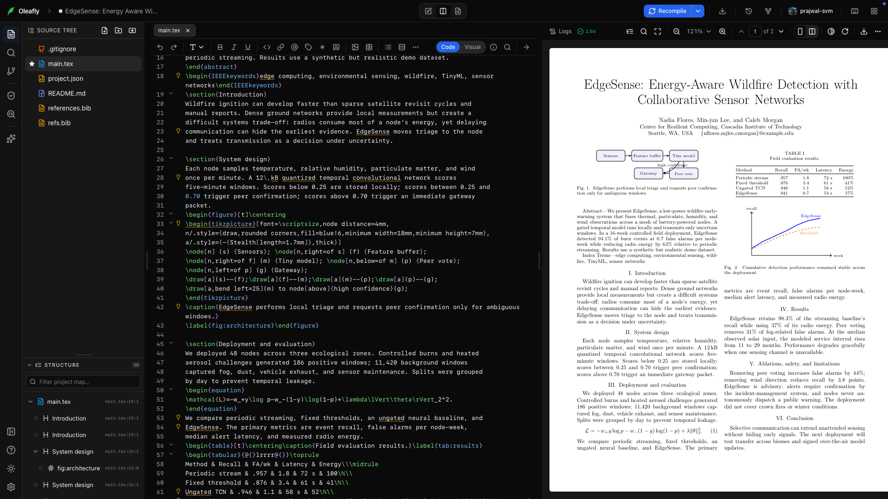
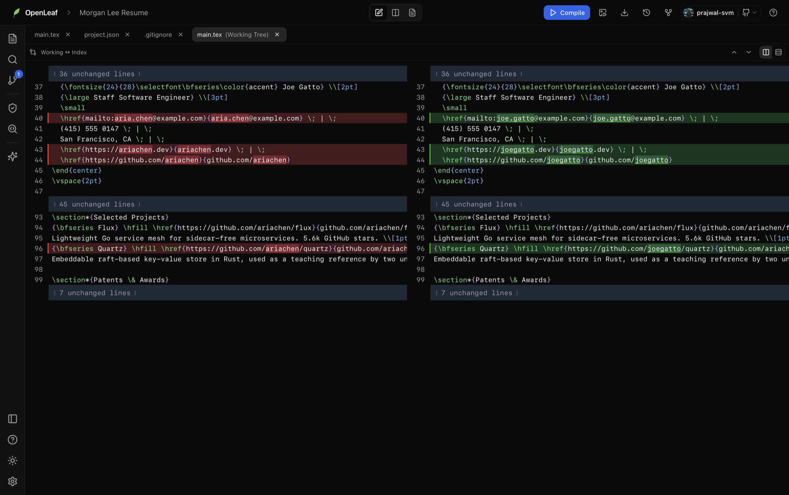
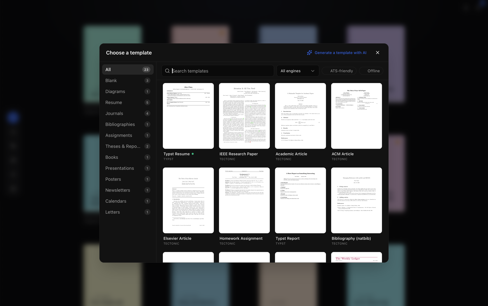
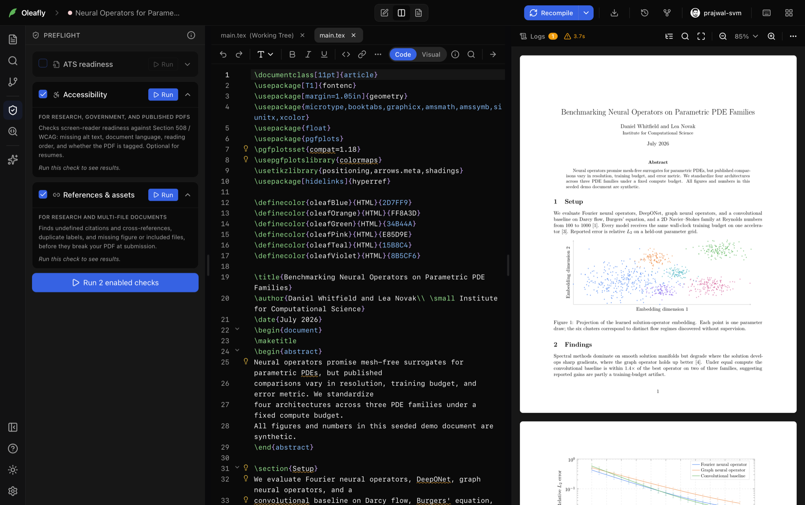

<div align="center">


# Oleafly

**Write, compile, and publish research with an AI workspace you own.**

Write in LaTeX, Typst, or Markdown. Compile beside your source. Keep every
revision in Git. Use AI on your terms.

Oleafly is a free, 100% open-source desktop app for macOS, Windows, and Linux.
It is local-first, works without an account, and keeps plain project files on
your computer.

[](https://github.com/Oleafly/Oleafly/releases/latest)
[](https://github.com/Oleafly/Oleafly/actions/workflows/ci.yml)
[](LICENSE)
[](https://github.com/Oleafly/Oleafly/releases/latest)
[](https://github.com/Oleafly/Oleafly)

**[Download Oleafly](https://github.com/Oleafly/Oleafly/releases/latest) ·
[Read the docs](https://oleafly.com/docs/) ·
[Build from source](docs/install.md)**

</div>

<div align="center">
  
</div>

<!--
Recording placeholder: hero-editor.png is the cover until a 45–60 second,
compressed workspace walkthrough is ready. Keep the same framing and replace
the source above with media/workspace-tour.webp.
-->

> [!NOTE]
> Oleafly is ready for day-to-day documents, but the project is still moving
> quickly. Advanced package compatibility and a few platform integrations are
> still being hardened. macOS builds are signed and notarized; Windows builds
> are not signed yet, so see the
> [first-launch instructions](docs/install.md#first-launch) and download only
> from the official releases page.

## Research has enough moving parts already

A technical document usually ends up spread across an editor, a compiler, a
PDF viewer, a bibliography tool, Git, and an AI chat that cannot see the actual
project. Oleafly brings that work into one desktop app while leaving the source
readable in other editors and command-line tools.

The same project view works for a course report, a journal paper, or a
hundred-page thesis:

| Your work | What Oleafly handles |
| --- | --- |
| Write | Source and visual editing, autocomplete, symbols, citations, figures, tables, and whole-project code intelligence |
| Compile | Bundled LaTeX and Typst engines, Markdown through Pandoc, parsed errors, logs, and offline cached builds |
| Inspect | A fast PDF preview, page and zoom controls, two-page layouts, color inversion, and bidirectional SyncTeX |
| Revise | Autosave, real Git history, diffs, restore, and GitHub sync |
| Submit | ATS and accessibility preflight, reference checks, reader-view extraction, and several export formats |
| Get help | An optional project-aware AI assistant, local Ollama models, hosted providers, and MCP clients |

If you like Overleaf's write-and-preview loop but want compilation, files, Git,
and model choice on your own machine, Oleafly is made for that workflow. It can
also replace much of the setup around a local editor, TeX toolchain, PDF viewer,
and Git client.

Oleafly does not offer live multi-user browser editing today. Git and GitHub
are the current collaboration path.

## What you can do

### Write with the source in reach

- Work with LaTeX, Typst, and Markdown projects, including large multi-file
  documents, images, includes, and bibliographies.
- Switch LaTeX and Markdown between Code and Visual views. Unsupported rich
  blocks stay visible as editable source instead of disappearing.
- Insert headings, lists, links, citations, cross-references, equations,
  fractions, figures, tables, and symbols from the editor toolbar.
- Use command, citation, label, file, and slash-command autocomplete.
- Find and replace, fold sections and environments, turn on Vim bindings, and
  run offline spelling and grammar checks.
- Jump to definitions, find references, rename labels or citation keys across
  the project, and inspect definitions on hover.

### Compile and read without leaving the project

- Compile LaTeX with the bundled Tectonic sidecar and Typst with its bundled
  engine. A full TeX installation is not required for the default workflow.
- See compiler failures as editor diagnostics and readable error cards rather
  than hunting through a raw log.
- Read the PDF beside the source with continuous scrolling, virtualized pages,
  single or two-page layouts, fit controls, page navigation, fullscreen, and
  an optional detached preview window.
- Use SyncTeX in both directions: jump from source to PDF, or
  Cmd/Ctrl-click PDF text to return to the matching source.
- Save the PDF into the project or export the source as a portable archive.

### Keep a history you can inspect

Every project is a real Git repository. Oleafly commits after successful
compiles and after quiet editing periods, then exposes the useful parts of that
history in the app.

- Review a commit timeline and side-by-side diffs.
- Restore an earlier file without replacing the rest of the project.
- Stage, discard, commit, push, and pull from the Source Control panel.
- Publish a project to GitHub or connect an existing repository.
- Keep working from the terminal or another editor; there is no private
  document format to unpack.

<div align="center">
  
</div>

### Start from something useful

The project gallery includes editable starters for papers, theses, reports,
books, presentations, posters, assignments, letters, bibliographies, resumes,
and diagrams. Filter by document engine, offline readiness, or ATS suitability.
Optional template packs and fonts download only when you choose them.

<div align="center">
  
</div>

### Move between research and publishing tasks

- Add a citation from a DOI, arXiv ID, URL, or title search. Oleafly writes a
  deduplicated BibTeX entry and inserts the citation at the cursor.
- Draw a diagram on a visual canvas or edit its TikZ directly, then insert it
  as vector source or an image. The saved TikZ can be reopened and edited.
- Import Word documents through Pandoc, reconstruct an editable LaTeX project
  from a PDF locally, or transcribe an equation image with a vision model.
- Export PDF and source archives, plus Word, HTML, Markdown, text, PowerPoint,
  or EPUB when the document engine and project type support them.
- Browse conference deadlines and use optional literature lookups without
  turning the project folder into a cloud document.

### Check the document before someone else does

Preflight looks at both source and compiled output. It catches broken
references, missing assets, duplicate labels, reading-order problems, missing
metadata, inaccessible figure patterns, and resume layouts that are difficult
for applicant tracking systems to parse.

It also shows the text a parser or screen reader can extract. These checks are
practical submission guidance, not a formal accessibility certification.

<div align="center">
  
</div>

### Let AI work on the project, if you want it

The assistant can read and edit files, search the project, compile, inspect the
log, and extract PDF text to check its own result. It can also help with
citations, imported documents, and editable TikZ figures.

You choose the model:

- Connect a supported hosted provider with your own API key.
- Run a local model through Ollama.
- Leave AI unconfigured and use the rest of the app normally.

File changes come with a diff and Approve or Reject controls. “Always allow”
can approve ordinary writes for the current session while deletes still stop
for confirmation.

Oleafly can also expose its project tools to Claude Desktop, Claude Code,
Cursor, and other MCP clients. MCP connections support read-only mode and
three approval policies: confirm every change, auto-approve writes while
confirming deletes, or trust the client's own approval gate.

See the [AI Assistant guide](docs/ai-assistant.md) and
[MCP setup](docs/mcp.md) for the current providers, tools, and security model.

## Local-first, with a clear network boundary

No account and no telemetry are required. Core project data stays on your
machine.

| Runs or stays local | Uses the network only when you ask |
| --- | --- |
| Project files and editor buffers | A hosted AI provider you connect |
| Git repositories and history | GitHub publish, push, and pull |
| Compilation with cached packages | TeX packages needed for the first compile |
| PDF rendering and text extraction | Optional templates, fonts, Pandoc, or TinyTeX downloads |
| Spellcheck, grammar, and preflight | Citation, literature, conference-deadline, and update lookups |
| Local AI through Ollama |  |

API keys are stored locally. Plain document files remain usable even if you
stop using Oleafly.

## Install

Download the latest build from
[GitHub Releases](https://github.com/Oleafly/Oleafly/releases/latest).

| Platform | Installer |
| --- | --- |
| macOS, Apple Silicon | `.dmg` |
| Windows, x86_64 | `.msi` or `-setup.exe` |
| Linux, x86_64 | `.AppImage`, `.deb`, or `.rpm` |

The first LaTeX compile may download packages required by the document.
Tectonic caches them for later builds, and Offline mode restricts compilation
to that cache.

To run from source:

```bash
git clone https://github.com/Oleafly/Oleafly.git
cd Oleafly
./scripts/fetch-tectonic.sh all
./scripts/fetch-typst.sh all
pnpm install
pnpm tauri dev
```

See the [installation guide](docs/install.md) for prerequisites, platform
instructions, and production builds.

## Documentation

User guides are available at [oleafly.com/docs](https://oleafly.com/docs/).
The repository keeps the contributor and implementation references close to
the code.

| Guide | Covers |
| --- | --- |
| [Getting started](docs/getting-started.md) | First project, first edit, first PDF |
| [Feature reference](docs/features.md) | The full product surface |
| [Install](docs/install.md) | Releases, first launch, source builds |
| [Document engines](docs/document-engines.md) | LaTeX, Typst, and Markdown capabilities |
| [AI assistant](docs/ai-assistant.md) | Providers, local models, tools, and approvals |
| [MCP server](docs/mcp.md) | External clients, access tokens, and approval policies |
| [GitHub sync](docs/github-sync.md) | Publish, link, push, and pull |
| [Keyboard shortcuts](docs/keyboard-shortcuts.md) | Editing and navigation shortcuts |
| [Research workflows](docs/research-workflows.md) | Papers, theses, references, and figures |
| [Resume workflows](docs/resume-workflows.md) | Templates, ATS checks, tailoring, and variants |
| [Architecture](docs/architecture.md) | System boundaries and extension points |
| [Development](docs/development.md) | Local setup, tests, and contribution workflow |

## Contributing

Oleafly is built in the open by
[Prajwal S Venkateshmurthy](https://github.com/prajwalsvenkatesh) and
contributors. Bug reports, fixes, templates, documentation, and careful
product feedback are welcome.

1. Read [CONTRIBUTING.md](CONTRIBUTING.md).
2. Open an issue before a large change; small, focused fixes can go straight
   to a pull request.
3. Run the relevant checks before submitting:

   ```bash
   pnpm build
   pnpm test
   cargo test --manifest-path src-tauri/Cargo.toml --lib
   ```

Please report security issues privately as described in
[SECURITY.md](SECURITY.md). Participation is covered by the
[Code of Conduct](CODE_OF_CONDUCT.md).

## Credits

Oleafly builds on
[Tauri](https://tauri.app/),
[React](https://react.dev/),
[CodeMirror](https://codemirror.net/),
[Tectonic](https://tectonic-typesetting.github.io/),
[Typst](https://typst.app/),
[pdf.js](https://mozilla.github.io/pdf.js/),
[Zustand](https://github.com/pmndrs/zustand),
[Tailwind CSS](https://tailwindcss.com/),
[Harper](https://writewithharper.com/), and
[Hunspell](https://hunspell.github.io/).

Oleafly is licensed under
[AGPL-3.0-or-later](LICENSE). Third-party notices are listed in
[THIRD_PARTY_LICENSES.md](THIRD_PARTY_LICENSES.md).
