<div align="center">


# Oleafly <sup><em>beta</em></sup>

[Deutsch](README.de.md) | [English](../../README.md) | [Español](README.es.md) | **Français** | [日本語](README.ja.md) | [한국어](README.ko.md) | [Português](README.pt.md) | [Русский](README.ru.md) | [中文](README.zh.md) | [العربية](README.ar.md)

[](https://github.com/Oleafly/Oleafly/releases/latest)
[](https://github.com/Oleafly/Oleafly/releases/latest)
[](https://github.com/Oleafly/Oleafly/releases/latest)

[](https://github.com/Oleafly/Oleafly/issues) [](https://github.com/Oleafly/Oleafly/releases) [](https://github.com/Oleafly/Oleafly/actions/workflows/ci.yml) [](https://sonarcloud.io/summary/new_code?id=Oleafly_Oleafly) [](https://sonarcloud.io/component_measures?id=Oleafly_Oleafly&metric=coverage) [](https://github.com/Oleafly/Oleafly/pulse) [](https://github.com/Oleafly/Oleafly/commits/main) [](../../LICENSE) [](https://oleafly.com/discord) [](https://github.com/Oleafly/Oleafly)

**Écrivez votre prochain article avec moins de tâches répétitives dans un espace de travail scientifique moderne.**

Oleafly est une application gratuite et open source pour la rédaction scientifique. Utilisez-la pour des articles, thèses, rapports, présentations, livres, CV et autres documents techniques. Travaillez en LaTeX, Typst ou Markdown. La source, le PDF, les citations, les figures, les vérifications, l'historique Git et les outils IA facultatifs restent dans le même projet.

<p>
  <a href="https://github.com/Oleafly/Oleafly/releases/latest"><strong>Télécharger gratuitement</strong></a>
· <a href="https://oleafly.com/docs/">Lire les guides</a> · <a href="../development.md">Compiler depuis les sources</a>
</p>


Gratuit pour toujours · Open source · Aucun compte · Aucune inscription · Aucun suivi

</div>

<div align="center">
  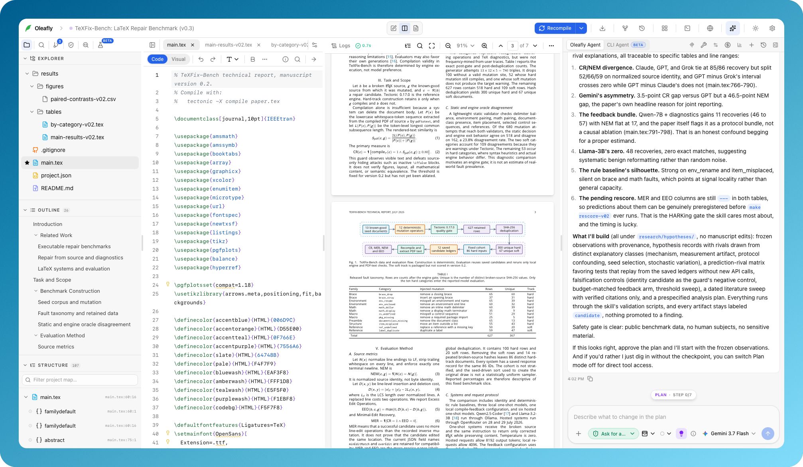
</div>

## Commencez ici

| Si vous... | Commencez par... |
| --- | --- |
| Rédigez un article ou une thèse | Un modèle LaTeX, Typst ou Markdown modifiable |
| Importez votre travail existant sur votre ordinateur | Un ZIP, un dépôt GitHub, un fichier Word, HTML ou Markdown, un document Typst, une source arXiv ou un PDF |
| Travaillez en LaTeX, Typst ou Markdown | L'éditeur source, l'éditeur visuel, l'aperçu en direct et le sélecteur de moteur |
| Construisez un manuscrit structuré | Le plan du projet, la recherche entre fichiers, la navigation dans les références et la relecture locale |
| Cherchez des sources ou des citations | Citation Search, une analyse du soutien documentaire ou l'importation d'une bibliographie depuis un fichier ou votre bibliothèque Zotero |
| Travaillez avec l'IA | L'assistant intégré, des Research Tasks isolées, un agent CLI ou MCP |
| Lancez une tâche de recherche plus longue | Un worktree séparé ou une copie préparée, des résultats examinés et l'application sélective des fichiers |
| Réutilisez un workflow de recherche | Le pack de skills inclus, les commandes slash ou un dossier de skills enregistré |
| Construisez une figure ou un tableau | Diagram Composer, LaTeX Preview, Image to LaTeX ou LaTeX Table Generator |
| Préparez une soumission | Preflight pour la compilation, les références, la confidentialité, l'accessibilité et les vérifications de la revue |
| Récupérez ou versionnez votre travail | Des points de restauration pour la récupération locale et Git pour un historique et une collaboration explicites |
| Liez des articles, des données ou des analyses | Des dossiers de recherche liés en lecture seule à côté du manuscrit |
| Exportez ou convertissez des documents | Des PDF et des ZIP de sources, ainsi que des exportations Word, HTML, Markdown, texte, PPTX ou EPUB prises en charge |
| Cherchez une chaîne d'outils locale | Tectonic, Typst et Pandoc inclus, avec en option un TeX système ou une installation TinyTeX gérée par l'application |

<div align="center">
  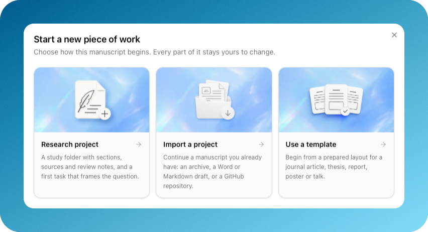
</div>
<p align="center"><em>Commencez par le type de travail dont vous disposez réellement : un nouveau projet de recherche, un projet existant ou un modèle.</em></p>

## Pourquoi Oleafly

La plupart des workflows de rédaction scientifique forment une chaîne d'outils séparés : un éditeur, un compilateur, un lecteur PDF, un gestionnaire de bibliographie, un outil de diagrammes, Git, une liste de vérification et, parfois, un chat IA qui ne voit pas le projet. Le travail se disperse entre plusieurs fenêtres au moment même où l'argumentation se complexifie.

Oleafly réunit ces outils autour d'un même projet. La source reste du texte brut. Le PDF est à côté. Vous pouvez trouver une citation depuis la phrase que vous écrivez, conserver une figure en TikZ et examiner les modifications de l'assistant avant qu'elles n'atteignent le projet.

### Trois façons de travailler

| Workflow | Ce que cela vous apporte | Ce qu'il vous reste à résoudre |
| --- | --- | --- |
| Éditeur cloud hébergé | Mise en route rapide, accès dans le navigateur et service géré | Faire confiance à une couche de données hébergée et adapter votre workflow à ses limites |
| Stack locale à construire soi-même | Contrôle des fichiers, des outils et de l'infrastructure | Choisir, installer, configurer et maintenir chaque élément |
| Oleafly | Un espace de travail de bureau local réunissant l'éditeur, les moteurs, le PDF, les citations, les figures, les vérifications, Git et les agents facultatifs | La coédition en direct et la synchronisation en arrière-plan entre appareils ne sont pas disponibles dans cette version |

Oleafly vous offre un espace de travail guidé, sans enfermer votre manuscrit dans un format propriétaire ni dans un service permanent.

## Ce qui reste sur votre ordinateur

Le travail essentiel reste sur votre ordinateur : fichiers du projet, indexation, compilation avec un moteur local disponible, aperçu PDF, vérification orthographique, vérification grammaticale, Preflight, historique Git, points de restauration et terminal. Aucun compte n'est nécessaire pour ces tâches.

L'application ne se connecte au réseau que pour les actions qui en ont besoin : recherche bibliographique, métadonnées DOI, opérations GitHub, IA hébergée, Zotero, serveurs MCP que vous connectez, recherche de paquets sur Typst Universe et CTAN, et téléchargement facultatif de moteurs, de paquets et de modèles. Les versions publiées vérifient aussi la présence d'une mise à jour à chaque démarrage de l'application. Les modèles Ollama locaux gardent le trafic du modèle sur votre ordinateur. Quand l'un de ces services est indisponible, l'application affiche un état hors ligne ou indisponible.

| Reste local par défaut | N'a lieu que si vous le choisissez |
| --- | --- |
| Source et métadonnées du projet | Recherche bibliographique et de citations |
| État de l'éditeur et index du projet | Connexion GitHub, push, pull et publication |
| Compilation LaTeX avec le moteur inclus lorsque les paquets sont disponibles | Fournisseurs IA hébergés |
| Compilation Typst lorsque les paquets sont en cache ou conservés dans le projet | Téléchargements facultatifs de moteurs, de paquets et de modèles |
| Rendu PDF et inspection du texte | Téléchargements de skills depuis la bibliothèque de domaines |
| Vérification orthographique, vérification grammaticale et Preflight | Clients MCP externes sur localhost |
| Historique Git et points de restauration automatiques | Zotero, alphaXiv et les autres serveurs MCP que vous connectez |

<p align="center">
  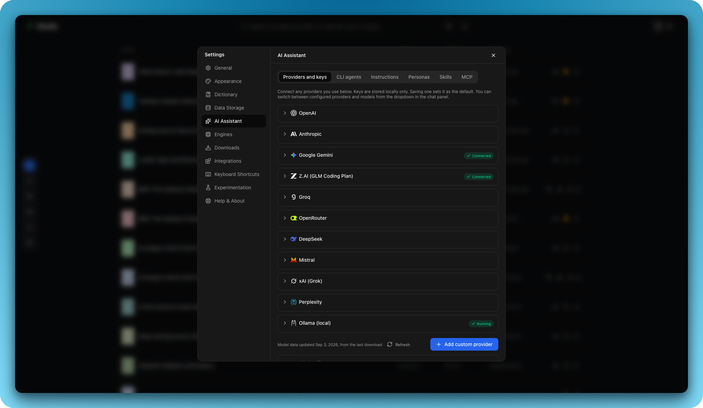
</p>
<p align="center"><em>Les connexions aux fournisseurs sont explicites et séparées du manuscrit stocké sur le disque.</em></p>

## Commencez avec un vrai projet

### Des modèles que vous pouvez modifier

Commencez par un article, un article de revue, une thèse, une revue de littérature, un rapport, un livre, une présentation Beamer, un poster, un devoir, une lettre, une bibliographie, un CV ou un diagramme. Les modèles sont des projets source ordinaires avec un moteur déclaré, un document principal, un type de document, des ressources et des métadonnées d'aperçu. Avant de créer le projet, vous pouvez voir un aperçu rendu et le moteur qu'il utilise.

La galerie filtre par moteur, catégorie, compatibilité hors ligne et adéquation ATS. Les modèles inclus fonctionnent sans compte de modèles. Les packs de modèles, polices et ressources facultatifs ne sont téléchargés qu'après votre sélection.

<div align="center">
  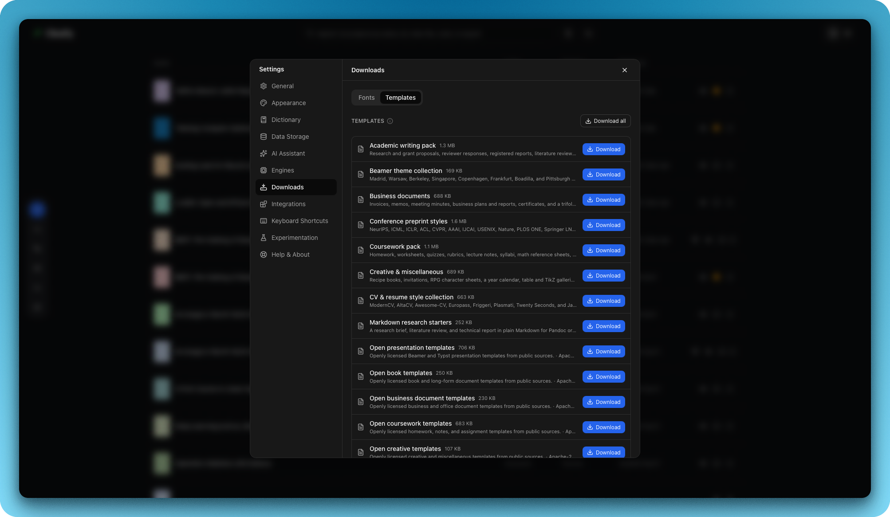
</div>

### Apportez votre travail existant

Importez un ZIP de projet ou un dépôt GitHub, convertissez un DOCX avec Pandoc ou utilisez un PDF comme point de départ pour créer du LaTeX modifiable. Les importations deviennent des fichiers de projet locaux ; la source d'origine reste donc intacte pendant que vous examinez le résultat.

Pour un PDF doté d'une couche de texte, la reconstruction est déterministe. Elle extrait le texte, la mise en page, les équations et les figures qu'elle peut identifier, signale ses limites et vous laisse un LaTeX modifiable plutôt qu'un document opaque. Un PDF numérisé peut être transcrit par un modèle de vision exécuté en local. Si vous connectez un fournisseur capable de vision, il peut ensuite aider à affiner le projet importé.

<p align="center">
  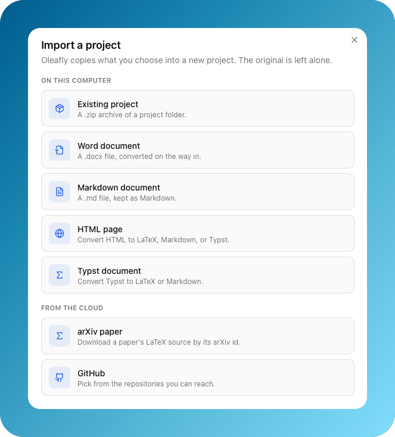
</p>
<p align="center"><em>Importez un projet ou un document existant dans un espace de travail local ordinaire.</em></p>

### Chaque projet est un dossier accessible sur votre disque

La bibliothèque Oleafly suit l'identité du projet, son moteur, le type de document, les signets, l'état de l'aperçu et l'historique. Le manuscrit reste un répertoire normal. Vous pouvez ouvrir la source dans un autre éditeur, l'inspecter dans un terminal, la partager avec un coauteur ou la versionner avec Git. Oleafly n'a pas besoin d'une base de données de documents propriétaire pour compiler votre travail.

L'application garde ses artefacts de compilation et ses métadonnées locales séparés de la source. Un projet peut conserver ses choix de moteur et de document principal dans `project.json`, afin qu'un clone ou une archive de sources exportée s'ouvre avec les mêmes réglages de projet.

<div align="center">
  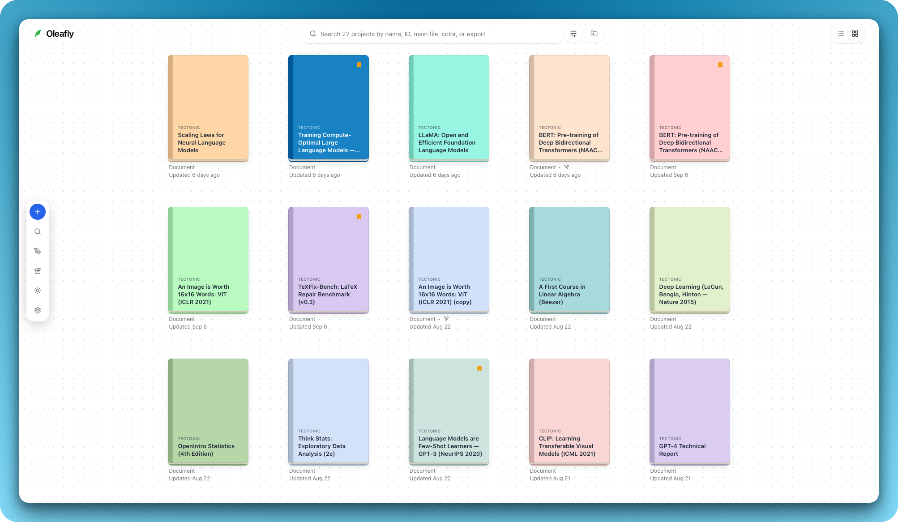
</div>

## Rédigez l'article en gardant sa structure

### Un éditeur source pour les documents structurés

L'éditeur CodeMirror s'appuie sur un index couvrant tout le projet. Cet index recense les titres, labels, clés de citation, macros, environnements, fichiers inclus et diagnostics de compilation du manuscrit.

En LaTeX, Typst, Markdown et BibTeX, vous disposez de :

- Mise en évidence syntaxique adaptée au moteur pour les commandes, environnements, mathématiques, commentaires, balises et entrées bibliographiques.
- Complétion des labels, clés de citation et chemins de fichiers du projet. Les fichiers LaTeX complètent aussi les commandes et environnements, et les fichiers Typst complètent les fonctions, les paquets et les styles bibliographiques.
- Diagnostics en direct pour la syntaxe, les erreurs de compilation, les citations indéfinies, les clés en double, les labels en double et les références rompues.
- Plan local et global du document avec symboles, labels, citations, macros et relations entre fichiers.
- Recherche et remplacement, pliage du code, onglets multi-fichiers, mode Vim, comptage des mots, insertion de commandes slash et raccourcis clavier configurables.
- Assistants structurels LaTeX pour `\item`, `\begin` / `\end`, les environnements, les délimiteurs mathématiques, les légendes et les schémas d'insertion courants.
- Assistants Typst : paires de `$` pour les mathématiques, les listes se poursuivent avec Entrée et `/` ouvre les extraits.
- Infobulles pour les numéros et pages de labels compilés, les aperçus d'équations et les miniatures des images ciblées par `\includegraphics`.

### Insérez des blocs LaTeX, de la mise en forme et des symboles

L'éditeur LaTeX garde les structures courantes à portée d'un clic tout en vous laissant la main sur la source. Passez de la vue Code à la vue Visual, annulez ou rétablissez une action, choisissez un niveau de titre, mettez le texte en forme, insérez des références et construisez un tableau ou une figure sans mémoriser chaque commande. Les fichiers Typst disposent des mêmes outils dans leur propre barre d'outils, qui écrit du balisage Typst.

<div align="center">
  
</div>
<p align="center"><em>Construisez un document LaTeX structuré depuis la barre d'outils, puis continuez à modifier directement la source.</em></p>

| Zone | Commandes disponibles |
| --- | --- |
| Édition et modes | Vue Code, vue Visual, annuler, rétablir |
| Structure du document | Insertion H1–H7 : `\part`, `\chapter`, `\section`, `\subsection`, `\subsubsection`, `\paragraph`, `\subparagraph` |
| Mise en forme en ligne | Gras `\textbf{}`, italique `\textit{}`, souligné `\underline{}`, code en ligne `\texttt{}` |
| Références et notes | Liens `\href{}{}`, citations du projet, renvois croisés `\ref{}`, notes de bas de page `\footnote{}` |
| Blocs de contenu | Citations en bloc avec `quote`, figures avec `\includegraphics`, légendes et labels, tableaux visuels avec lignes et colonnes sélectionnables, listes à puces `itemize`, listes numérotées `enumerate` |
| Blocs mathématiques | Insertion de `equation`, `align` et de fractions `\frac{}{}` |
| Insertion assistée par IA | Image to LaTeX pour une équation, un tableau ou du texte visible lorsqu'un fournisseur capable de vision est configuré |
| Intelligence du code | Aller à la définition, trouver les références et renommer un symbole dans tout le projet |
| Outils du projet | Dessiner un diagramme, Paquets LaTeX, Analyse du document et Réglages du document |

### Une palette de symboles LaTeX consultable

Le sélecteur de symboles contient 236 commandes uniques dans la vue **All**. Les listes par catégorie contiennent 238 entrées, car `\nabla` et `\partial` sont utiles à la fois dans Operators et Calculus. Recherchez par nom de symbole ou commande LaTeX, puis insérez le résultat à la position du curseur. Dans un fichier Typst, la palette affiche, recherche et insère le nom Typst de chaque symbole.

| Catégorie | Nombre | Symboles et commandes disponibles |
| --- | ---: | --- |
| Grec minuscule | 29 | `\alpha`, `\beta`, `\gamma`, `\delta`, `\epsilon`, `\varepsilon`, `\zeta`, `\eta`, `\theta`, `\vartheta`, `\iota`, `\kappa`, `\lambda`, `\mu`, `\nu`, `\xi`, `\pi`, `\varpi`, `\rho`, `\varrho`, `\sigma`, `\varsigma`, `\tau`, `\upsilon`, `\phi`, `\varphi`, `\chi`, `\psi`, `\omega` |
| Grec majuscule | 11 | `\Gamma`, `\Delta`, `\Theta`, `\Lambda`, `\Xi`, `\Pi`, `\Sigma`, `\Upsilon`, `\Phi`, `\Psi`, `\Omega` |
| Opérateurs | 19 | `+`, `-`, `\times`, `\div`, `\cdot`, `\pm`, `\mp`, `\ast`, `\star`, `\circ`, `\bullet`, `\oplus`, `\ominus`, `\otimes`, `\odot`, `\dagger`, `\ddagger`, `\nabla`, `\partial` |
| Relations | 21 | `=`, `\neq`, `<`, `>`, `\leq`, `\geq`, `\ll`, `\gg`, `\approx`, `\sim`, `\simeq`, `\cong`, `\equiv`, `\propto`, `\prec`, `\succ`, `\preceq`, `\succeq`, `\perp`, `\parallel`, `\mid` |
| Flèches | 23 | `\leftarrow`, `\rightarrow`, `\uparrow`, `\downarrow`, `\leftrightarrow`, `\Leftarrow`, `\Rightarrow`, `\Uparrow`, `\Downarrow`, `\Leftrightarrow`, `\mapsto`, `\longmapsto`, `\longrightarrow`, `\longleftarrow`, `\hookrightarrow`, `\hookleftarrow`, `\nearrow`, `\searrow`, `\nwarrow`, `\swarrow`, `\rightleftharpoons`, `\leftharpoonup`, `\rightharpoonup` |
| Théorie des ensembles | 19 | `\in`, `\notin`, `\ni`, `\subset`, `\supset`, `\subseteq`, `\supseteq`, `\cup`, `\cap`, `\bigcup`, `\bigcap`, `\setminus`, `\emptyset`, `\varnothing`, `\mathbb{N}`, `\mathbb{Z}`, `\mathbb{Q}`, `\mathbb{R}`, `\mathbb{C}` |
| Logique | 16 | `\forall`, `\exists`, `\nexists`, `\neg`, `\land`, `\lor`, `\wedge`, `\vee`, `\implies`, `\iff`, `\therefore`, `\because`, `\top`, `\bot`, `\vdash`, `\models` |
| Calcul | 18 | `\int`, `\iint`, `\iiint`, `\oint`, `\sum`, `\prod`, `\coprod`, `\lim`, `\infty`, `\nabla`, `\partial`, `\sqrt{}`, `\frac{}{}`, `\binom{}{}`, `\sup`, `\inf`, `\max`, `\min` |
| Fonctions | 19 | `\sin`, `\cos`, `\tan`, `\cot`, `\sec`, `\csc`, `\arcsin`, `\arccos`, `\arctan`, `\sinh`, `\cosh`, `\tanh`, `\log`, `\ln`, `\exp`, `\det`, `\dim`, `\ker`, `\arg` |
| Délimiteurs | 16 | `(`, `)`, `[`, `]`, `\{`, `\}`, `\langle`, `\rangle`, `\lfloor`, `\rfloor`, `\lceil`, `\rceil`, barre verticale littérale, `\|`, `\left( \right)`, `\left[ \right]` |
| Accents | 14 | `\hat{}`, `\bar{}`, `\tilde{}`, `\vec{}`, `\dot{}`, `\ddot{}`, `\acute{}`, `\grave{}`, `\breve{}`, `\check{}`, `\overline{}`, `\underline{}`, `\overbrace{}`, `\underbrace{}` |
| Points et espaces | 13 | `\cdots`, `\ldots`, `\vdots`, `\ddots`, `\quad`, `\qquad`, `\,`, `\;`, `\!`, `\text{}`, `\mathrm{}`, `\mathbf{}`, `\mathcal{}` |
| Divers | 20 | `\hbar`, `\ell`, `\wp`, `\Re`, `\Im`, `\aleph`, `\angle`, `\triangle`, `\diamond`, `\square`, `\lozenge`, `\clubsuit`, `\diamondsuit`, `\heartsuit`, `\spadesuit`, `^{\circ}`, `\#`, `\$`, `\%`, `\&` |

<div align="center">
  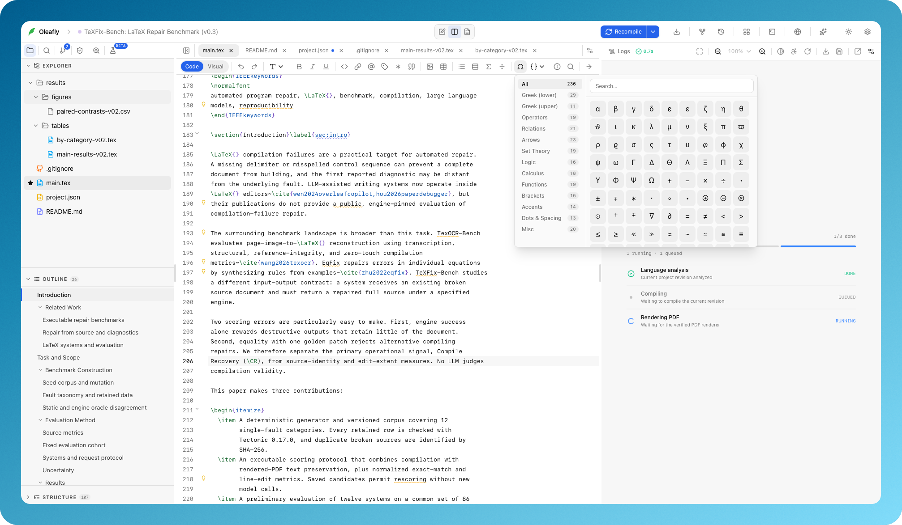
</div>
<p align="center"><em>Recherchez 236 commandes LaTeX uniques par catégorie ou par nom et insérez celle dont vous avez besoin.</em></p>

<div align="center">
  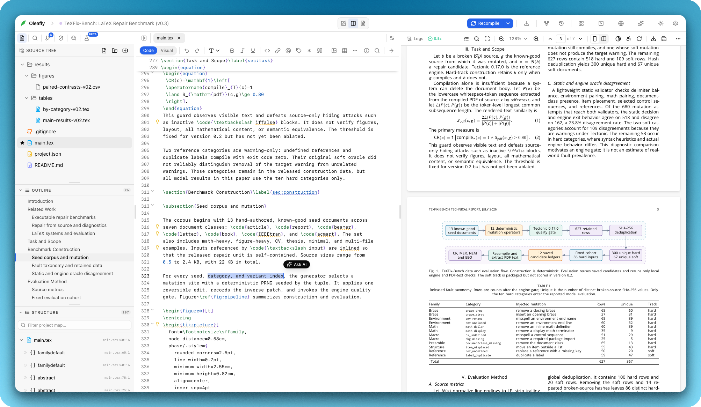
</div>

### Vue source et vue visuelle

La vue source est la représentation de référence. Lorsque le moteur le permet, activez l'éditeur visuel pour LaTeX, Typst ou Markdown et modifiez la prose, les équations, les citations, les tableaux et les figures sur une surface orientée page. Les mathématiques, notes de bas de page, théorèmes, figures, tableaux et couleurs s'affichent comme des nœuds natifs modifiables ; le texte enrichi et les images collés deviennent le balisage propre au document, et une barre d'outils flottante modifie les tableaux sur place. La source reste disponible pour Git, les éditeurs externes et les modifications manuelles.

Utilisez la vue visuelle pour les retouches à l'échelle de la page. Revenez à la source lorsque vous avez besoin d'un contrôle précis des commandes, paquets, environnements ou de la mise en page.

<p align="center">
  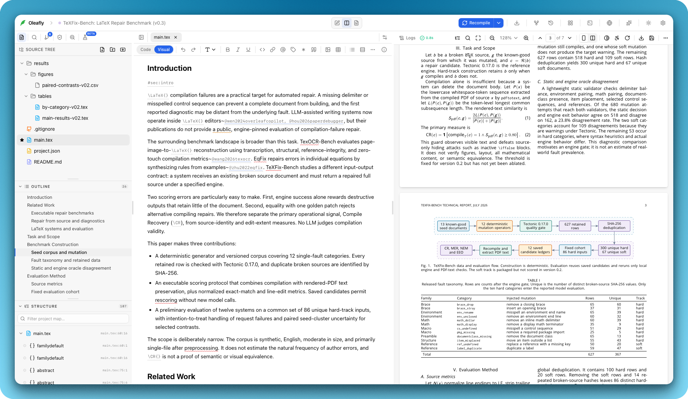
</p>

### Relisez votre prose en local

Hunspell gère l'orthographe avec le pack de dictionnaire sélectionné et vos ajouts personnels ou propres au projet. Harper vérifie la grammaire et le style au moyen d'un masque de prose tenant compte du document ; les commandes, commentaires, corps mathématiques et arguments machine ne sont donc pas traités comme de la prose ordinaire.

Le profil académique évite les règles qui gênent l'écriture scientifique et chaque résultat propose une action locale : le remplacer, l'ignorer (pour l'instant, dans ce projet ou partout) ou désactiver la règle. Les règles que vous avez désactivées apparaissent dans Paramètres, pour que vous puissiez les réactiver. La relecture s'exécute en local et ne nécessite aucun fournisseur IA.

### Recherchez dans tout le projet

Recherchez dans tout le projet depuis le panneau Recherche. L'index du projet relie fichiers source, titres, labels, citations, macros et fichiers inclus ; une thèse composée de nombreux fichiers est ainsi plus facile à parcourir qu'une série d'onglets d'éditeur.

## Compilez avec LaTeX, Typst ou Markdown

Oleafly garde la compilation près du manuscrit et transforme la sortie du compilateur en diagnostics liés à la source. Le moteur est choisi par projet ; l'éditeur, l'aperçu, SyncTeX, Preflight et les commandes d'export suivent les capacités réelles du moteur.

| Moteur | Utilisation principale | Détails importants |
| --- | --- | --- |
| LaTeX avec Tectonic | Compilations LaTeX portables avec moteur inclus | Inclus dans l'application de bureau ; prend en charge les projets multi-fichiers, les images, les citations, Biber (sauf sur Linux ARM64), SyncTeX, la compilation isolée de figures et les compilations hors ligne mises en cache lorsque les paquets sont disponibles |
| LaTeX avec `latexmk` | Projets qui nécessitent une distribution TeX système complète | Utilise MacTeX, TeX Live, MiKTeX ou TinyTeX ; prend en charge `glossaries`, `makeidx` et XeLaTeX ou LuaLaTeX (choisi automatiquement) ; `minted`, PythonTeX et les autres modèles qui utilisent le shell escape fonctionnent une fois que vous autorisez les commandes externes sur cet ordinateur |
| Typst | Rédaction rapide de documents modernes | Compilateur inclus, sortie PDF, indexation du projet et citations ; synchronisation entre la source et le PDF à partir de Typst 0.13, et compilations hors ligne quand les paquets sont en cache ou conservés dans le projet. La compilation isolée de figures n'est pas disponible dans cette version |
| Markdown avec Pandoc | Prose légère et workflows de conversion | Pandoc est inclus dans l'application. Il convertit en LaTeX pour que le Tectonic inclus le compose, et exporte en Word, HTML, EPUB, PowerPoint, LaTeX, Typst et texte brut |

Les projets LaTeX reçoivent une analyse de compatibilité à leur ouverture. Si un projet demande plus que ce que le moteur inclus peut gérer, Oleafly explique l'écart et vous oriente vers le bon moteur ou paquet. TeX système s'exécute par défaut avec des commandes shell restreintes ; vous activez séparément le shell escape complet pour chaque projet et chaque ordinateur.

Le Biber inclus est associé à la version de biblatex de Tectonic. Les journaux de compilation distinguent l'exécutable Biber manquant, une incompatibilité de version et une erreur LaTeX ordinaire afin que vous puissiez choisir la bonne correction.

<div align="center">
  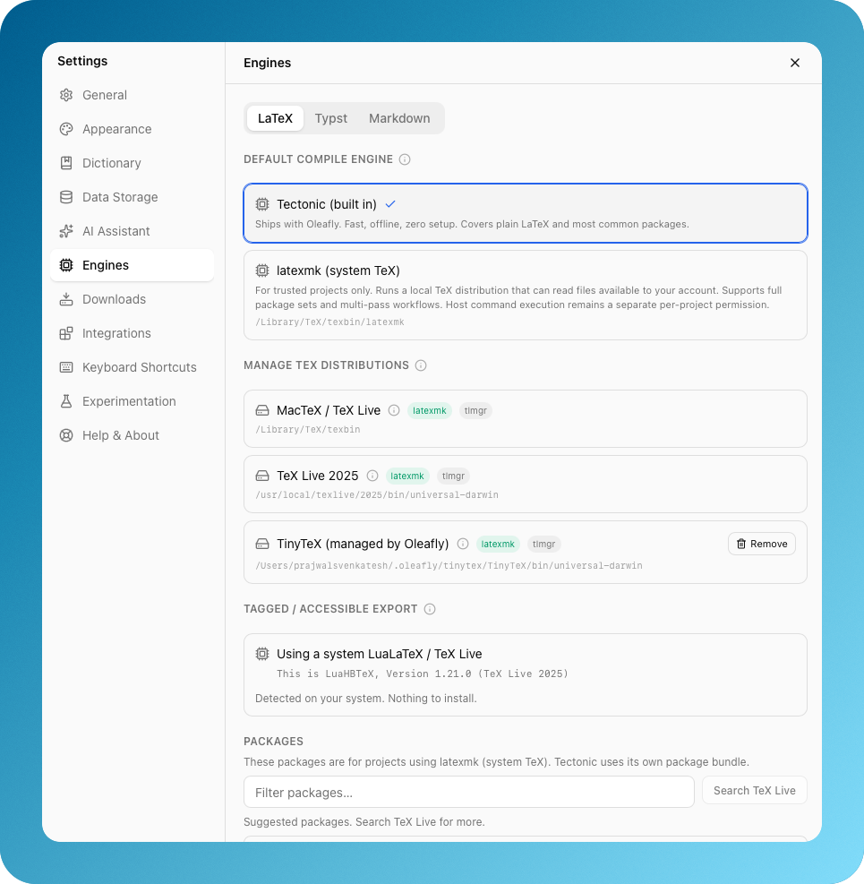
</div>

## Lisez le PDF à côté de la source

Le lecteur PDF est intégré à l'espace de travail et peut aussi s'ouvrir dans une fenêtre d'aperçu détachée. Il garde visible le dernier PDF accepté pendant qu'une nouvelle compilation s'exécute ou échoue ; une modification défectueuse n'efface donc pas le dernier résultat lisible.

Utilisez le défilement continu ou un affichage d'une page ou de deux pages. Zoomez, ajustez à la largeur ou à la hauteur, faites pivoter, inversez les couleurs, recherchez dans le texte du document, suivez le plan, allez à une page, téléchargez avec le nom de fichier choisi ou consultez le journal de compilation dans la même vue. Les PDF chiffrés affichent une demande de mot de passe plutôt qu'un lecteur vide.

La commande Aller au PDF vous amène de la source à l'endroit correspondant du PDF, et un clic dans le PDF vous ramène à la ligne source. LaTeX s'appuie pour cela sur SyncTeX, et Typst, à partir de la version 0.13, sur le serveur de langage Tinymist. Markdown et les versions plus anciennes de Typst ne peuvent pas synchroniser, donc ces contrôles n'apparaissent pas.

<div align="center">
  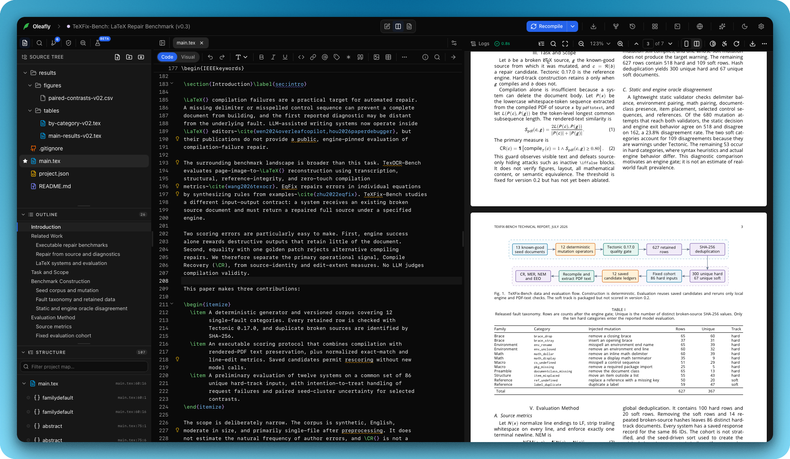
</div>

## Littérature et citations

### Recherchez depuis la phrase que vous écrivez

Citation Search interroge arXiv, Semantic Scholar, Crossref, PubMed et OpenAlex au même endroit, ainsi que Google Scholar lorsque vous ajoutez une clé Serper. Il regroupe les résultats en double, garde les métadonnées visibles et vous permet d'enregistrer une référence dans la bibliothèque de littérature locale.

Vous pouvez aussi rechercher une citation par DOI, ID arXiv, URL ou titre. Importez une bibliothèque existante depuis Zotero RDF, EndNote XML, RIS ou BibTeX, ou connectez Zotero dans Paramètres > Intégrations et importez toute votre bibliothèque depuis le panneau Références. L'index du projet fournit la complétion des clés de citation, la navigation entre références, des détails au survol et des diagnostics pour les citations indéfinies, les clés en double et les métadonnées bibliographiques incomplètes.

### Recherchez les références manquantes dans le document

Depuis le mode document, Oleafly découpe la sélection ou le manuscrit en paragraphes de prose, interroge les sources de littérature configurées, retire les articles déjà présents dans la bibliographie et classe le reste sur une échelle de 0 à 100. Un fournisseur IA peut ajouter un bref raisonnement POUR / CONTRE. Lorsque l'IA est désactivée, l'analyse utilise un classement heuristique local.

Enregistrez les résultats dans la bibliothèque de citations locale, copiez le BibTeX ou ajoutez une entrée sélectionnée à la bibliographie du projet et insérez sa citation.

### Relisez un article avec deux voix

Le mode de relecture peut utiliser un fournisseur IA configuré pour lire le document actuel ou une sélection capturée selon deux styles :

- Amical : les points forts d'abord, puis des suggestions précises et constructives.
- Feu : un test de résistance façon Reviewer #2, centré sur les affirmations, les méthodes et les preuves.

La relecture est une action facultative de l'assistant. Elle ne remplace ni les consignes de la revue ni un coauteur humain.

### Gardez les dossiers de recherche à côté du manuscrit

Liez un jeu de données, une bibliothèque de sources, un dossier d'analyse ou un autre répertoire de recherche sans le déplacer dans le projet. Oleafly lit les dossiers liés et n'y écrit jamais. Ils restent exclus de la compilation, de la recherche du projet et de Git ; si un chemin est indisponible, l'interface indique clairement qu'il manque ou qu'il est illisible.

### Recherchez des laboratoires et des échéances

La galerie d'outils comprend Lab Search pour les institutions de recherche répertoriées par OpenAlex, avec des filtres par pays et des liens vers les fiches institutionnelles, ROR et OpenAlex. Conference Deadlines permet de rechercher des conférences, de les filtrer par domaine de recherche et de suivre les comptes à rebours. Les données d'échéances sont fournies avec l'application et peuvent être actualisées. La plupart des conférences relèvent de l'informatique, et quelques-unes de domaines comme les neurosciences et la physique.

## Figures, équations et tableaux

### Diagram Composer

Diagram Composer vous demande d'abord à quoi sert le diagramme : TikZ pour LaTeX, un diagramme fletcher pour Typst ou un organigramme Mermaid pour Markdown. Dessinez sur un canevas avec des rectangles, cercles, ellipses, losanges, textes, connecteurs, aimantation, couleurs de remplissage et de bordure, annuler, rétablir, mini-carte et canevas clair ou sombre. Le panneau de code et le dessin restent synchronisés dans les deux sens, et le code que le canevas ne sait pas dessiner est conservé tel quel. Les figures TikZ se compilent isolément, les diagrammes Typst se prévisualisent avec le Typst du projet et Mermaid utilise le moteur de rendu de l'application.

La source enregistrée conserve le modèle du diagramme pour une prochaine modification, et Diagram Composer importe les fichiers `.tikz`, `.tex`, `.typ`, `.mmd` et `.md`. Insérez le code à la position du curseur, ou enregistrez un PNG et la source dans le dossier `figures` du projet. La réparation IA facultative peut aider en cas d'erreur de compilation de la figure, et un modèle capable de vision peut examiner un rendu et affiner sa mise en page.

<div align="center">
  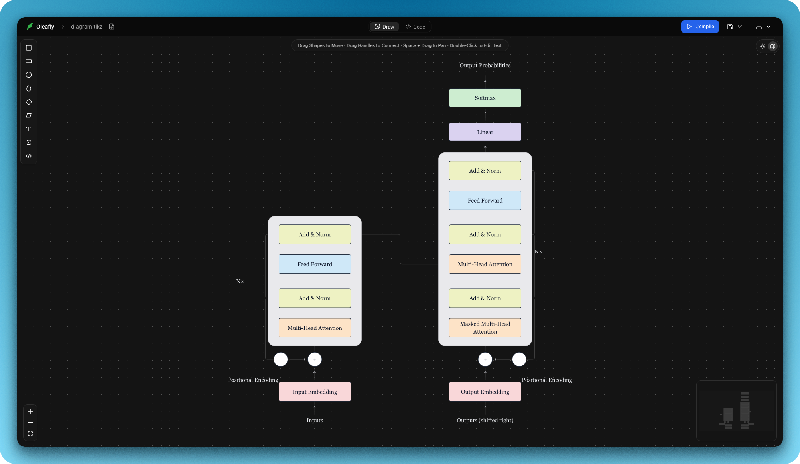
</div>

### Sortie des équations et des tableaux

L'outil LaTeX to Image rend une équation et exporte un PNG ou un SVG. Il peut aussi copier du MathML pour Word ou du HTML KaTeX, et son mode Typst copie des mathématiques Typst. L'outil Table to LaTeX propose un éditeur visuel en lignes et colonnes et exporte du LaTeX ordinaire, et CSV to Typst et Excel to Typst construisent des tableaux Typst. Image to LaTeX et Image to Typst transcrivent une équation, un tableau ou du texte visible dans une image avec un modèle de vision exécuté en local. Le bouton Image to LaTeX de la barre d'outils de l'éditeur utilise plutôt le fournisseur capable de vision que vous avez configuré.

Ces outils se trouvent dans la galerie Tools, en bêta et désactivée par défaut (voir la section Les outils de la galerie ci-dessous). Une fois qu'elle est activée, ils sont aussi disponibles dans la palette de commandes et, lorsque l'application les affiche, dans les commandes slash.

<div align="center">
  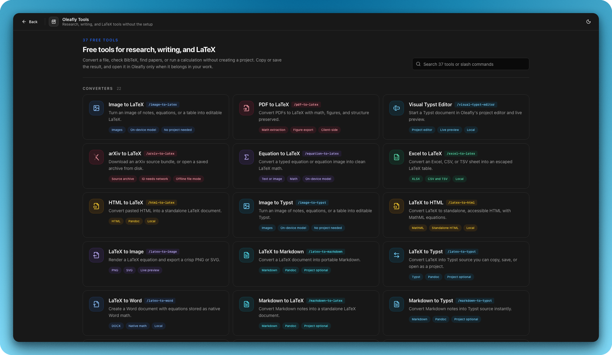
</div>

## Vérifiez le document avant qu'il ne quitte votre ordinateur

Preflight lit la source, la structure du projet, le journal du compilateur et le PDF actuel. Il regroupe les résultats par problème et indique l'origine de chaque résultat. Les vérifications peuvent s'exécuter ensemble ou séparément ; une entrée manquante est signalée comme indisponible ou partielle, et non comme une réussite. Les projets Typst ont leurs propres vérifications de la source pour les références et citations non résolues, le texte alternatif manquant, les métadonnées du document, les images manquantes, la confidentialité et l'évaluation anonyme. Les projets Markdown n'ont que les vérifications du journal de compilation et du PDF.

| Vérification | Ce qu'elle recherche |
| --- | --- |
| Compilation et mise en page | Compilations échouées, citations et références non résolues, avertissements de recompilation, glyphes manquants, boîtes trop pleines, texte tronqué, destinations PDF en double et formats de page mélangés |
| Préparation à la soumission | Classe du document, résumé, mots-clés, formats de figures, polices incorporées, version et restrictions du PDF, noms de fichiers portables, légendes et empaquetage propre des sources |
| Préparation ATS | Extraction du texte du CV, coordonnées, sections attendues, longueur du document et mises en page qui brouillent souvent les systèmes de suivi des candidatures |
| Accessibilité | Balises, texte alternatif, langue et titre du document, réglages du lecteur, structure des titres et tableaux, descriptions des liens, ordre de lecture, texte sélectionnable, signets et texte très petit |
| Références et ressources | Fichiers manquants, citations et renvois indéfinis, labels et DOI en double, champs bibliographiques incomplets, entrées non citées et figures manquantes |
| Confidentialité et évaluation anonyme | Identifiants, clés privées, fichiers sensibles, balisage de brouillon, commentaires internes, champs d'auteur, remerciements et métadonnées d'identité du PDF |

Les profils de publication couvrent la publication générale, arXiv, IEEE, ACM, les autres revues et les thèses. Vous devez tout de même consulter le guide actuel aux auteurs de la revue pour connaître ses marges exactes, limites de pages, règles de taille des fichiers et consignes de soumission.

Les vérifications d'accessibilité font référence à PDF/UA, Matterhorn et WCAG et signalent la partie de PDF/UA-1 vérifiable automatiquement. La préparation d'un export accessible peut ajouter des métadonnées LaTeX, des déclarations d'en-tête de tableau et des espaces réservés pour le texte alternatif lorsque la classe et les paquets actifs le permettent. Pour Typst, la préparation de l'export propose PDF/A et PDF/UA.

Preflight est un ensemble de vérifications automatiques, pas un certificat de conformité. Il ne peut pas juger si un texte alternatif est pertinent, si l'ordre de lecture est logique ou si le contraste est suffisant. Pour une déclaration formelle de conformité en matière d'accessibilité, validez le PDF final avec l'outil exigé par la revue.

<div align="center">
  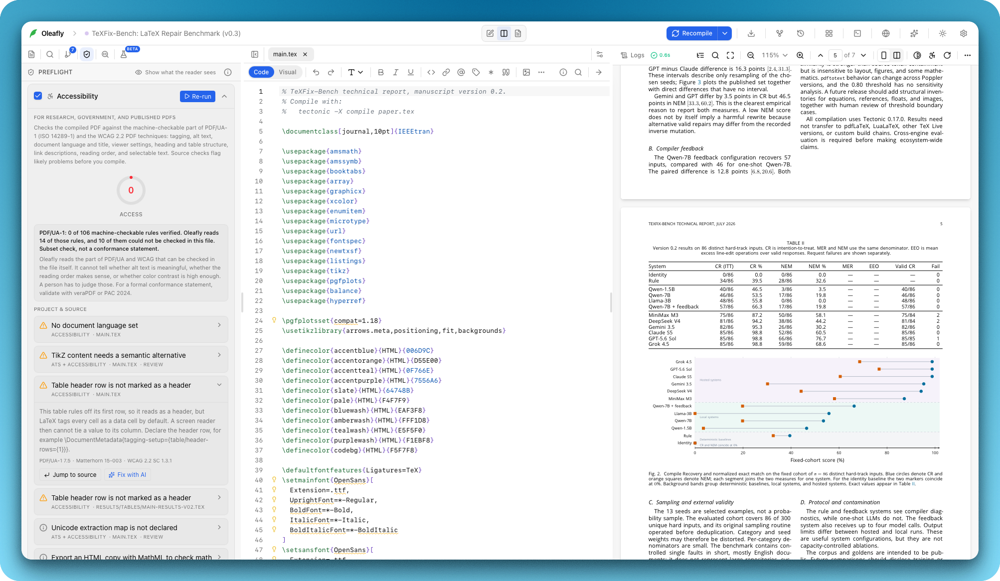
</div>
<p align="center"><em>Preflight rend visibles les résultats d'accessibilité vérifiables automatiquement avant la soumission ; il ne suffit pas à lui seul pour déclarer la conformité.</em></p>

## Versionnez et récupérez votre travail

### Utilisez votre dépôt Git comme d'habitude

Oleafly fonctionne avec un dépôt Git normal. Le panneau Source Control peut initialiser un dépôt, afficher des diffs unifiés ou côte à côte, indexer des fichiers, abandonner des changements, effectuer des commits, push, pull et afficher l'état en avance ou en retard par rapport à un distant. Vous pouvez aussi publier un projet sur GitHub ou connecter un dépôt existant. L'Explorateur marque les fichiers modifiés avec les mêmes lettres d'état et, si Git n'est pas installé, Source Control explique comment l'obtenir.

Les projets nouveaux ou ouverts reçoivent un dépôt Git, et un nouveau projet commence généralement par un seul commit « Create project ». Désactivez ce comportement avec l'option Initialiser Git pour chaque projet dans Paramètres. Après cela, enregistrer, compiler ou fermer un projet ne crée jamais de commit. Oleafly ne cache pas la source à votre terminal et ne modifie pas le `.gitignore` du projet simplement pour masquer ses propres métadonnées.

<p align="center">
  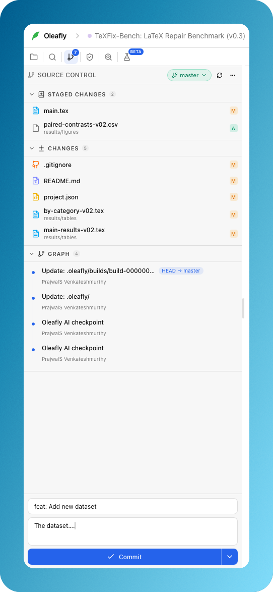
</p>
<p align="center"><em>Consultez les changements indexés, les branches, l'historique et les commits sans quitter le projet.</em></p>

### Utilisez les points de restauration pour récupérer rapidement

Après une compilation réussie, Oleafly peut enregistrer un instantané local du projet. Les points de restauration n'initialisent pas de dépôt, ne créent pas de commits et ne modifient pas de branche. Restaurez transactionnellement un état antérieur, donnez un libellé à une version importante, inspectez les fichiers enregistrés, supprimez l'ancien historique ou déplacez un historique complet dans une archive chiffrée.

Utilisez Git pour les commits, branches, dépôts distants et collaborations que vous choisissez. Utilisez les points de restauration pour récupérer rapidement une copie locale pendant qu'un article évolue rapidement.

<div align="center">
  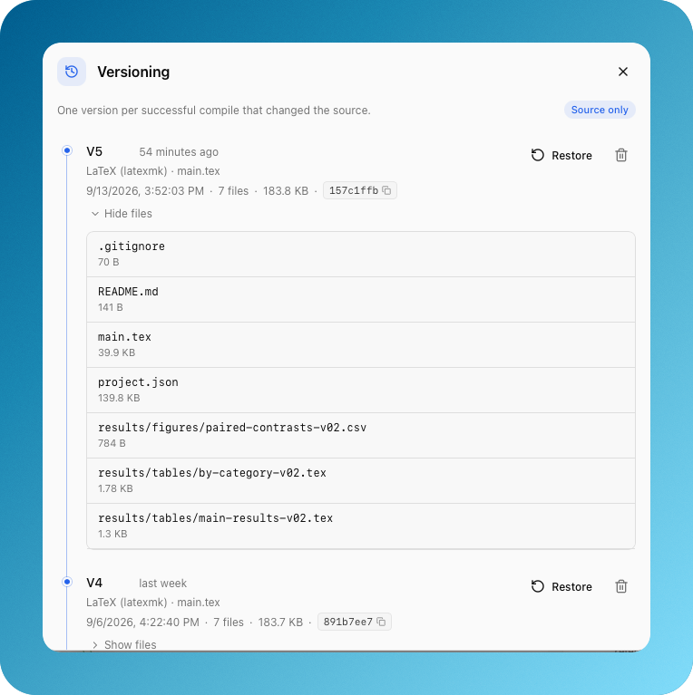
</div>

## L'IA est facultative

L'éditeur, le compilateur, l'aperçu PDF, les citations, la relecture et Preflight fonctionnent avec l'IA désactivée. Lorsqu'elle est activée, l'IA utilise les mêmes fichiers de projet et les mêmes outils que le reste de l'application.

### Demandez à un assistant au sujet du projet ouvert

Avec un fournisseur configuré, l'assistant peut :

- Lire un fichier du projet ou effectuer une recherche dans le projet avant de répondre.
- Expliquer une section, une équation, une citation ou une erreur de compilation.
- Réviser la prose, créer des fichiers, renommer des fichiers et effectuer des remplacements ciblés.
- Compiler le projet, lire le journal, extraire le texte du PDF et examiner les pages rendues lorsque le réglage de capture PDF est activé.
- Rechercher dans la littérature, vérifier un DOI, ajouter une citation et cartographier les titres, labels, citations, macros et relations entre fichiers du document.
- Rédiger, compiler, inspecter, réparer et insérer des figures TikZ ou PGFPlots modifiables en LaTeX, et des figures CeTZ ou fletcher en Typst.

Chaque modification de fichier produit un diff visible. Choisissez un mode d'approbation dans le chat : Demander l'autorisation, Autoriser à ma place, Accès complet ou Personnalisé, qui suit les règles du fichier `approvals.toml`. Après un tour, une ligne indique combien de fichiers ont changé. Relisez chaque modification, annulez ou rétablissez un fichier, ou annulez tout le tour. Le mode Plan permet à l'assistant de cartographier le projet avant de l'autoriser à écrire, compiler ou exécuter des commandes.

Connectez un fournisseur hébergé, un endpoint compatible OpenAI ou un modèle Ollama local. Les identifiants des fournisseurs vivent dans un stockage chiffré géré par l'application et ne sont pas écrits dans les fichiers du projet. L'action que vous choisissez vous indique lorsqu'une requête hébergée sera envoyée.

<div align="center">
  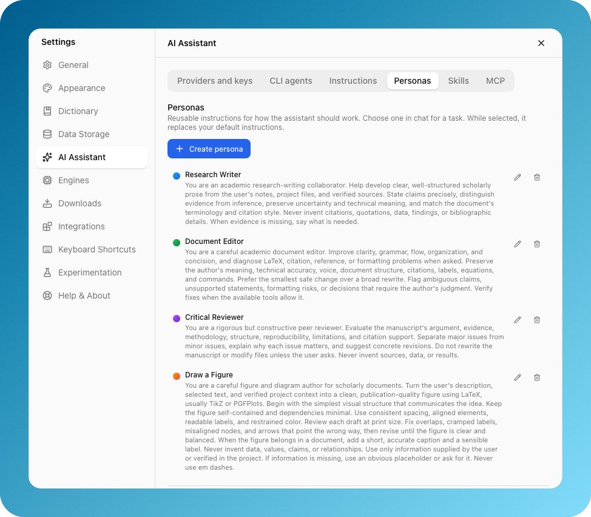
</div>
<p align="center"><em>Choisissez un rôle adapté à la tâche, de la rédaction scientifique et de l'édition de documents à la relecture critique et au travail sur les figures.</em></p>

<details>
<summary>Examinez une modification avant son application</summary>

En mode Demander l'autorisation, lisez le diff de fichier proposé et choisissez les modifications à appliquer. En mode Personnalisé, l'option Toujours dans ce projet enregistre une règle d'autorisation pour cet outil. Les suppressions restent visibles séparément et peuvent exiger une confirmation explicite.

</details>

### Exécutez séparément les tâches de recherche plus longues

Lancez une tâche pour une revue de littérature, un audit des preuves, une analyse, une révision de manuscrit ou une réponse aux évaluateurs. Elle s'exécute dans un worktree Git ou une copie préparée, pendant que vous continuez dans le projet d'origine. Sous Windows, les agents CLI ne peuvent pas encore exécuter ces tâches, et les tâches exécutées par l'Assistant Oleafly ne peuvent pas lancer de commandes shell. Codex ne peut pas les exécuter sous macOS.

À la fin, examinez l'activité, les sorties et chaque fichier modifié. Prévisualisez le diff, sélectionnez les fichiers à conserver et appliquez uniquement ceux-ci. Le projet d'origine reste inchangé tant que vous n'appliquez pas les résultats examinés. Si le projet a changé pendant l'exécution, Oleafly détecte la dérive au lieu d'appliquer un ancien diff sur du travail plus récent.

### Utilisez un agent CLI du catalogue

Le catalogue comprend 14 agents CLI. Chacun utilise son propre compte, ses permissions et sa configuration de modèle ; Oleafly lui fournit le contexte du projet et l'espace de travail environnant. Dans Paramètres, vous pouvez aussi trouver d'autres agents dans le registre ACP ou ajouter un agent personnalisé.

| Agent | Commande |
| --- | --- |
|  Claude Code | `claude` |
|  Codex CLI | `codex` |
|  Gemini CLI | `gemini` |
|  Pi | `pi` |
|  OpenCode | `opencode` |
|  OpenClaw | `openclaw` |
|  Cline | `cline` |
|  Hermes Agent | `hermes` |
|  CodeBuddy | `codebuddy` |
|  Kimi Code | `kimi` |
|  Grok Build | `grok` |
|  Cursor | `agent` |
|  DeepSeek Harness | `dsh` |
|  Qoder | `qodercli` |

<small>Ces marques identifient des outils compatibles et restent la propriété de leurs détenteurs respectifs. Elles n'impliquent aucun parrainage.</small>

Ouvrez une conversation, connectez-vous via le CLI propre à l'agent lorsque nécessaire, reconnectez-vous, suivez l'activité des outils, orientez un tour en cours, arrêtez-le et conservez la transcription avec la session du projet lorsque ces fonctions sont prises en charge. Les demandes d'autorisation montrent la modification que l'agent veut effectuer. L'accueil de l'agent propose des points de départ pour la recherche, comme Exploration de la littérature et Audit des citations, et vous pouvez exporter une conversation en Markdown ou en JSON.

La prise en charge des agents CLI est en bêta. Paramètres indique pour chaque agent l'état d'installation, les limites de la plateforme et le programme trouvé par Oleafly, avec un bouton Tester. La conversation vous signale quand un agent ne peut pas reprendre une session enregistrée.

### Réutilisez un workflow de recherche avec des skills

Oleafly inclut des skills pour la littérature, la rédaction, les figures, la relecture, la soumission, la communication et les outils. Les skills sont des dossiers `SKILL.md` ordinaires qui suivent la structure Agent Skills.

Utilisez un skill avec une commande slash, ajoutez votre propre dossier, enregistrez un workflow reproductible à partir d'une conversation terminée ou installez un skill de domaine depuis la bibliothèque lorsque vous choisissez de le télécharger. Les skills peuvent être partagées avec des agents CLI compatibles sur le même ordinateur. Une skill déjà installée continue de fonctionner hors ligne. Recherchez parmi vos skills et dans la bibliothèque de domaines, et activez chaque skill pour tous les projets ou seulement pour le projet ouvert.

### Skills incluses dans Oleafly

Le pack inclus `research-core` fournit 36 skills. Les noms ci-dessous sont les identifiants utilisés par le catalogue et les réglages du projet.

| Catégorie | Skills |
| --- | --- |
| Recherche et littérature | `citation-management`, `exploratory-data-analysis`, `hypothesis-generation`, `literature-review`, `oleafly-literature-sweep`, `oleafly-research-loop`, `openresearch`, `paper-lookup`, `research-lookup`, `scientific-brainstorming`, `scientific-critical-thinking` |
| Rédaction et analyse de manuscrits | `experimental-design`, `oleafly-data-analysis`, `oleafly-manuscript-scaffold`, `oleafly-related-work`, `scientific-writing`, `statistical-analysis`, `statistical-power`, `venue-templates` |
| Figures et visualisation | `oleafly-figure-prep`, `scientific-schematics`, `scientific-visualization` |
| Relecture et preuves | `oleafly-response-letter`, `oleafly-review-manuscript`, `oleafly-verify-claims`, `peer-review`, `scholar-evaluation` |
| Soumission | `oleafly-pre-submission` |
| Communication | `oleafly-slides-and-posters`, `pptx-posters`, `research-grants`, `scientific-slides` |
| Importation et outils de compilation | `import-refine`, `oleafly-latex-build`, `pdf-to-latex`, `template-generate` |

<p align="center">
  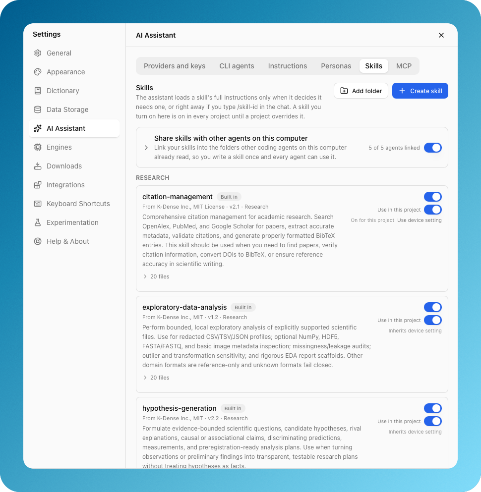
</p>
<p align="center"><em>Les skills transforment une routine de recherche utile en workflow que vous pouvez réutiliser et partager avec des agents compatibles.</em></p>

### Connectez un client IA externe avec MCP

Oleafly peut exécuter un serveur MCP local pour un client externe. Il expose les mêmes outils de projet que l'assistant intégré : lister et lire les fichiers, rechercher dans le projet, inspecter sa carte, compiler, lire le journal, extraire le texte du PDF, prévisualiser des figures et appliquer des modifications selon la politique d'approbation d'Oleafly.

Le serveur se lie uniquement à `127.0.0.1`, utilise un bearer token que vous pouvez régénérer dans Paramètres et ne fonctionne que lorsque le processus Oleafly est ouvert. Le mode lecture seule retire les outils qui modifient l'état de la liste d'outils. Le client externe apporte son propre modèle ; vous n'avez donc pas besoin d'ajouter une clé API IA dans Oleafly pour cette voie.

L'assistant peut aussi utiliser des serveurs MCP externes. Importez les réglages d'un serveur, ou cherchez dans le registre MCP officiel et examinez une entrée avant de l'ajouter. alphaXiv se connecte avec une clé API ; l'assistant peut alors rechercher et lire des articles, et il vous demande votre accord avant chaque appel.

## Les outils de la galerie

La galerie Tools est en bêta et désactivée par défaut. Activez-la dans Paramètres > Expérimentation > Outils LaTeX, puis ouvrez-la depuis l'omnibar ou la palette de commandes. Recherchez par nom, description ou commande slash. Un outil qui nécessite une connexion réseau ou un fournisseur IA l'indique dans son propre panneau.

### Recherchez dans l'espace de travail depuis un seul champ

Appuyez sur Cmd+Shift+F (Ctrl+Shift+F sous Windows et Linux) pour rechercher des projets et des documents, ouvrir les réglages, créer un projet, changer de thème ou lancer un outil depuis un même endroit. Saisissez `/` pour réduire la liste aux commandes et garder les mains sur le clavier pendant votre travail. La palette de commandes, sur Cmd+K (Ctrl+K), ne liste que des commandes.

<p align="center">
  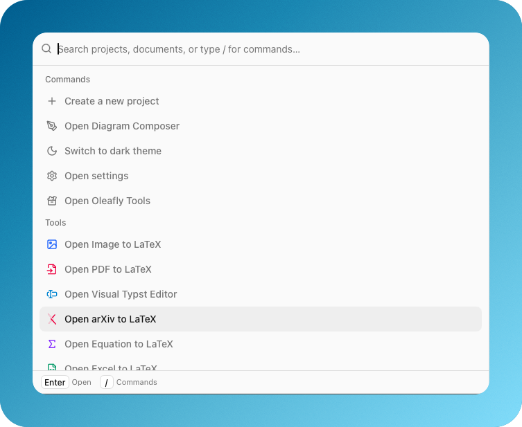
</p>

### Importation et conversion de formats

| Outil | Utilisation |
| --- | --- |
| PDF to LaTeX | Reconstruire un LaTeX modifiable à partir d'un PDF, en conservant les mathématiques, les figures et la structure lorsque la source le permet |
| arXiv to LaTeX | Télécharger un paquet de sources arXiv par identifiant ou décompresser une archive enregistrée sur le disque |
| Image to LaTeX | Transformer une image de notes, d'équations ou d'un tableau en LaTeX modifiable |
| Equation to LaTeX | Convertir des mathématiques saisies ou une image d'équation en LaTeX |
| Excel to LaTeX | Convertir une feuille Excel, CSV ou TSV en tableau LaTeX avec échappement |
| HTML to LaTeX | Convertir du HTML collé en document LaTeX autonome |
| Image to Typst | Transformer une image de notes, d'équations ou d'un tableau en Typst modifiable |
| LaTeX to HTML | Convertir du LaTeX en HTML autonome avec des équations MathML |
| LaTeX to Image | Rendre une équation et exporter un PNG ou un SVG |
| LaTeX to Markdown | Convertir un document LaTeX en Markdown portable |
| LaTeX to Typst | Convertir du LaTeX en source Typst que vous pouvez copier, enregistrer ou ouvrir comme projet |
| LaTeX to Word | Créer un document Word avec des équations enregistrées comme mathématiques Word natives |
| Markdown to LaTeX | Convertir des notes Markdown en document LaTeX autonome |
| Markdown to Typst | Convertir des notes Markdown en source Typst |
| Mermaid to LaTeX | Convertir un organigramme Mermaid en code TikZ modifiable |
| PDF to Markdown | Extraire la couche de texte, les équations et les figures d'un PDF vers Markdown |
| PDF to Typst | Extraire la couche de texte, les équations et les figures d'un PDF vers Typst |
| Table to LaTeX | Construire un tableau LaTeX dans un éditeur visuel en lignes et colonnes |
| Typst Editor | Commencer un projet Typst avec édition de la source, aperçu en direct et export PDF |
| Visual Typst Editor | Commencer un document Typst dans l'éditeur de projet avec aperçu en direct |
| Typst to LaTeX | Convertir le balisage Typst en LaTeX pour les revues et les soumissions |
| arXiv to Typst | Convertir un paquet de sources arXiv en Typst, avec une vérification de compilation qui liste ce qui n'a pas été converti |
| CSV to Typst | Coller des lignes CSV ou TSV et obtenir un tableau Typst avec échappement |
| Equation to Typst | Convertir des mathématiques LaTeX saisies ou une image d'équation en mathématiques Typst |
| Excel to Typst | Convertir une feuille Excel, CSV ou TSV en tableau Typst avec échappement |
| HTML to Typst | Convertir du HTML collé en document Typst autonome |
| Mermaid to Typst | Convertir un organigramme Mermaid en code fletcher modifiable |
| Typst to HTML | Convertir le balisage Typst en HTML autonome avec des équations MathML |
| Typst to Markdown | Convertir le balisage Typst en Markdown portable |
| Typst to Word | Créer un document Word avec des équations enregistrées comme mathématiques Word natives |
| Word to Typst | Convertir un document Word en Typst et conserver les médias extraits ensemble |
| Word to LaTeX | Convertir un document Word en LaTeX et conserver les médias extraits ensemble |

### Mathématiques, tableaux, rédaction et validation

| Outil | Utilisation |
| --- | --- |
| BibTeX Validator | Vérifier les erreurs de syntaxe, les champs obligatoires manquants et les clés en double dans les fichiers `.bib` |
| Statistics Calculators | Calculer localement les p-values, les tailles d'échantillon et les intervalles de confiance |
| Writing Generators | Préparer avec l'assistant un résumé, une synthèse, une paraphrase ou un plan de thèse à partir du document ouvert |
| Symbol Reference | Parcourir les symboles LaTeX et en insérer un à la position du curseur, ou son nom Typst dans un fichier Typst |

### Littérature, références et recherche

| Outil | Utilisation |
| --- | --- |
| Find Citations | Rechercher dans les index scientifiques, analyser un brouillon pour trouver les références manquantes et exporter du BibTeX |
| arXiv Citation Generator | Rechercher un article arXiv et formater sa citation selon huit styles |
| Bibliography Generator | Construire, valider, trier et exporter une bibliographie à partir de détails structurés ou de BibTeX |
| Citation Generator | Transformer les détails d'un article ou un identifiant scientifique en citation et BibTeX formatés |
| Citation Generators by Style | Comparer une référence en APA, MLA, Chicago, IEEE, Harvard, Vancouver, AMA et ACS |
| DOI to BibTeX | Récupérer une notice DOI, examiner ses champs et exporter du BibTeX |
| ISBN to BibTeX | Récupérer les métadonnées d'un livre depuis son ISBN et les corriger avant d'exporter du BibTeX |
| PubMed to BibTeX | Récupérer une notice PubMed depuis son PMID, l'examiner et exporter du BibTeX |
| URL to BibTeX | Reconnaître les liens DOI, arXiv et PubMed, ou construire une citation modifiable pour une page web |
| Lab Search | Trouver des institutions de recherche dans l'annuaire OpenAlex |
| Conference Deadlines | Filtrer les échéances de conférences, surtout en informatique, et afficher les comptes à rebours |

L'espace de travail des équations peut aussi exporter un PNG, un SVG, du MathML pour Word ou du HTML KaTeX, et il dispose d'un mode Typst. Table to LaTeX produit du LaTeX ordinaire, et CSV to Typst et Excel to Typst produisent des tableaux Typst. Writing Generators préparent une invite pour l'assistant configuré ; ils ne fournissent pas de modèle à eux seuls.

La palette de commandes donne aussi accès à la recompilation, la compilation automatique, SyncTeX, l'export PDF, l'effacement du cache de compilation, le comptage des mots, l'historique Git, les points de restauration, le terminal, l'insertion de citations, les assistants de mise en forme, les assistants d'environnement, les réglages de thème, le mode Vim, la vérification orthographique et le mode hors ligne. Elle permet aussi de présenter des diapositives, de convertir un projet LaTeX en Typst, de parcourir les paquets LaTeX et Typst, d'ouvrir Analyse du document et Réglages du document, et de fermer tous les onglets de l'éditeur ou seulement les fichiers ouverts par l'assistant.

## Un terminal à côté de l'article

Ouvrez des onglets shell pour le projet actif sans quitter l'espace de travail. Jusqu'à dix sessions de terminal peuvent être ouvertes par projet. Renommez et colorez les onglets, fermez une ou plusieurs sessions et conservez leurs libellés avec le projet.

Utilisez un onglet pour exécuter un script, inspecter un jeu de données, vérifier un fichier généré ou utiliser un autre outil CLI. C'est votre shell, avec le même répertoire de projet à la disposition des commandes que vous choisissez d'exécuter. Les chemins de fichiers et les adresses web dans la sortie sont des liens. Cmd-cliquez sur l'un d'eux (Ctrl-clic sous Windows et Linux) pour ouvrir un fichier du projet à la ligne et à la colonne indiquées par la sortie, un PDF ou une image dans sa visionneuse, ou une adresse web dans le navigateur.

<p align="center">
  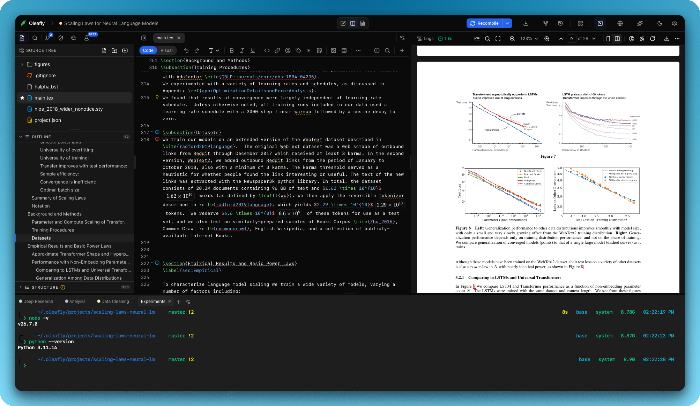
</p>
<p align="center"><em>Exécutez les commandes du projet dans un onglet de terminal sans quitter l'espace de travail de l'éditeur et du PDF.</em></p>

## Navigateur pour les tâches de computer use

Le navigateur intégré est en bêta et désactivé par défaut. Activez-le dans Paramètres > Expérimentation > Navigateur web. Il s'ouvre dans une fenêtre distincte du système d'exploitation avec des onglets, une barre d'adresse, des commandes de navigation et des webviews de contenu isolées. Il sert principalement de surface de computer use : un agent peut ouvrir une URL et attendre son chargement pendant que vous gardez le manuscrit dans la fenêtre principale.

L'outil computer use ne peut pas lire, capturer, cliquer sur le contenu d'une page ni l'exécuter sous forme de script. Les pages distantes n'ont pas accès à l'IPC d'Oleafly et la navigation externe suit la politique d'approbation active. Utilisez les outils de littérature lorsque vous avez besoin de métadonnées ou de citations interrogeables.

## Workflows de recherche courants

| Cas d'utilisation | Comment Oleafly aide |
| --- | --- |
| Premier article | Commencez avec un modèle d'article, écrivez avec le plan visible et compilez au fur et à mesure |
| Thèse ou dissertation | Gardez les chapitres, figures, références et annexes dans un projet indexé avec des points de restauration |
| Revue de littérature | Recherchez des sources, analysez les paragraphes pour trouver les références manquantes, enregistrez les métadonnées et organisez les preuves avec des skills de recherche |
| Analyse reproductible | Liez les dossiers de données et d'analyse en lecture seule, gardez le manuscrit séparé et utilisez le terminal pour les commandes du projet |
| Article de conférence | Utilisez des modèles propres à la revue, SyncTeX, des outils pour les figures et tableaux et une vérification avant soumission |
| Présentation ou poster Beamer | Commencez avec un modèle de présentation ou de poster, exportez les formats pris en charge et présentez à partir du PDF compilé avec un mode présentateur facultatif |
| Livre ou rapport long | Utilisez une arborescence source multi-fichiers, un plan, des références dans tout le projet, la navigation PDF et l'export EPUB lorsque pris en charge |
| CV | Utilisez des modèles de CV, la relecture locale, l'extraction du texte PDF et les contrôles de préparation ATS |
| Manuscrit multilingue | Choisissez le moteur Unicode et les polices système du modèle lorsque le projet nécessite XeLaTeX ou LuaLaTeX |
| Assistant de laboratoire ou d'équipe | Utilisez des Research Tasks isolées, un agent CLI ou le serveur MCP localhost avec des contrôles d'approbation |

## Télécharger Oleafly

Gratuit pour toujours · Open source · Aucun compte · Aucune inscription · Aucun suivi

| Plateforme | Paquet | Télécharger |
| --- | --- | --- |
| macOS · Apple Silicon | DMG | [](https://github.com/Oleafly/Oleafly/releases/latest) |
| Windows · x86_64 | MSI ou EXE | [](https://github.com/Oleafly/Oleafly/releases/latest) |
| Linux · x86_64 | AppImage, DEB ou RPM | [](https://github.com/Oleafly/Oleafly/releases/latest) |
| Linux · ARM64 | AppImage, DEB ou RPM | [](https://github.com/Oleafly/Oleafly/releases/latest) |

L'application de bureau inclut Tectonic pour LaTeX, un compilateur Typst et Pandoc pour les compilations Markdown et les conversions de documents. LaTeX compile hors ligne lorsque le moteur inclus dispose déjà des paquets nécessaires, et Typst compile hors ligne lorsque ses paquets sont en cache ou conservés dans le projet.

Sur x86_64, les paquets Linux nécessitent glibc 2.35 ou une version plus récente (Ubuntu 22.04 ou plus récent). Les paquets ARM64 sont construits sur Ubuntu 24.04 (glibc 2.39). Les versions incluent des artefacts de mise à jour signés et le programme de mise à jour intégré vérifie la signature avant l'installation. Les [notes de version](https://github.com/Oleafly/Oleafly/releases/latest) indiquent le contenu de chaque installateur.

## En savoir plus

- [Guides produit](https://oleafly.com/docs/)
- [Carte des fonctionnalités](../features.md)
- [Guide de l'éditeur](../Editor.md)
- [Aperçu PDF](../PDFPreview.md)
- [Citations et littérature](../Citations.md)
- [Galerie d'outils](../Tools.md)
- [Preflight et contrôles d'accessibilité](../Preflight.md)
- [Modèles](../Templates.md)
- [Diagram Composer](../DiagramComposer.md)
- [Git et contrôle de code source](../SourceControl.md)
- [Points de restauration](../Checkpoints.md)
- [AI Copilot](../AICopilot.md)
- [Skills](../Skills.md)
- [Intégration MCP](../mcp.md)
- [Configuration du développement](../development.md)

## Version actuelle

Oleafly est en bêta. La coédition en direct, les commentaires et la synchronisation en arrière-plan entre appareils ne sont pas disponibles dans cette version. Markdown n'offre pas encore de synchronisation entre la source et le PDF ni de vérifications Preflight de la source, et la synchronisation Typst nécessite Typst 0.13 ou une version plus récente. Vérifiez le moteur actif dans l'application et consultez le [journal des modifications](../../CHANGELOG.md) pour suivre les changements.

## Communauté et assistance

Rejoignez la [communauté Oleafly sur Discord](https://oleafly.com/discord) pour poser vos questions, obtenir de l'aide sur une compilation récalcitrante, montrer ce que vous écrivez et voter pour ce qui sera développé ensuite. C'est gratuit et ouvert à tout le monde. Si vous préférez GitHub, signalez un bug ou demandez une fonctionnalité dans les [Issues GitHub](https://github.com/Oleafly/Oleafly/issues).

Oleafly est développé par [Prajwal Murthy](https://github.com/prajwal-svm) et des contributeurs. Les contributions au code, aux modèles, à la documentation et aux retours sont les bienvenues. Consultez le [guide de contribution](../../CONTRIBUTING.md) pour participer.

Si vous utilisez Oleafly, une [étoile GitHub](https://github.com/Oleafly/Oleafly) aide d'autres chercheurs à le découvrir.

## Citer Oleafly

<details>
<summary>Copier l'entrée BibTeX</summary>

```bibtex
@software{oleafly,
  author  = {Venkateshmurthy, Prajwal S. and {The Oleafly contributors}},
  title   = {Oleafly: a local-first desktop workspace for research writing},
  year    = {2026},
  version = {0.4.4},
  url     = {https://github.com/Oleafly/Oleafly},
  license = {AGPL-3.0-or-later}
}
```

</details>

[Sécurité](../../SECURITY.md) · [Code de conduite](../../CODE_OF_CONDUCT.md) · [AGPL-3.0-or-later](../../LICENSE)

## Historique des étoiles

<a href="https://www.star-history.com/?repos=Oleafly%2FOleafly&type=date&legend=top-left">
 <picture>
   <source media="(prefers-color-scheme: dark)" srcset="https://api.star-history.com/chart?repos=Oleafly/Oleafly&type=date&theme=dark&legend=top-left&sealed_token=aHz2JA-SBvmD73PyT7aCcCqMyAUvCPtidSAAvsQQxR8-1xdB-RZ-oXHKRnqIJUfSICl6Dd3_XPcHgb5Menvk_FfalfMb1GRbJC_TdeTMBVDi3jVUIXBBdovZ4dufhj4JWF3UXptJhw8pGmB6lqQ-X7gDOWu_bkPTQ7k-Q0VeBiq_jNgwRb7RSMgrSb-P" />
   <source media="(prefers-color-scheme: light)" srcset="https://api.star-history.com/chart?repos=Oleafly/Oleafly&type=date&legend=top-left&sealed_token=aHz2JA-SBvmD73PyT7aCcCqMyAUvCPtidSAAvsQQxR8-1xdB-RZ-oXHKRnqIJUfSICl6Dd3_XPcHgb5Menvk_FfalfMb1GRbJC_TdeTMBVDi3jVUIXBBdovZ4dufhj4JWF3UXptJhw8pGmB6lqQ-X7gDOWu_bkPTQ7k-Q0VeBiq_jNgwRb7RSMgrSb-P" />
   
 </picture>
</a>
