<div align="center">


# Oleafly <sup><em>beta</em></sup>

[Deutsch](README.de.md) | [English](../../README.md) | [Español](README.es.md) | [Français](README.fr.md) | [日本語](README.ja.md) | [한국어](README.ko.md) | [Português](README.pt.md) | [Русский](README.ru.md) | **中文** | [العربية](README.ar.md)

[](https://github.com/Oleafly/Oleafly/releases/latest)
[](https://github.com/Oleafly/Oleafly/releases/latest)
[](https://github.com/Oleafly/Oleafly/releases/latest)

[](https://github.com/Oleafly/Oleafly/issues) [](https://github.com/Oleafly/Oleafly/releases) [](https://github.com/Oleafly/Oleafly/actions/workflows/release.yml) [](https://sonarcloud.io/summary/new_code?id=Oleafly_Oleafly) [](https://sonarcloud.io/component_measures?id=Oleafly_Oleafly&metric=coverage) [](https://github.com/Oleafly/Oleafly/pulse) [](https://github.com/Oleafly/Oleafly/commits/main) [](../../LICENSE) [](https://oleafly.com/discord) [](https://github.com/Oleafly/Oleafly)

永久免费 · 开源 · 无需账户 · 无需注册 · 无跟踪

**在现代科学写作工作空间中，减少琐事，写好你的下一篇论文。**

Oleafly 是一款免费的桌面工作空间，用于通过 LaTeX、Typst 和 Markdown 撰写论文。你可以在同一处查找资料、管理引文，并看到论文逐步成形。让 AI 助手修改一个章节、制作一幅图，或修复失败的构建；你可以审阅每一项改动。项目保存在你拥有的普通文件中，编辑器可在启用或不启用 AI 的情况下使用。

<p>
  <a href="https://github.com/Oleafly/Oleafly/releases/latest"><strong>免费下载</strong></a>
· <a href="https://oleafly.com/docs/">阅读指南</a> · <a href="../development.md">从源代码构建</a>
</p>

</div>

<div align="center">
  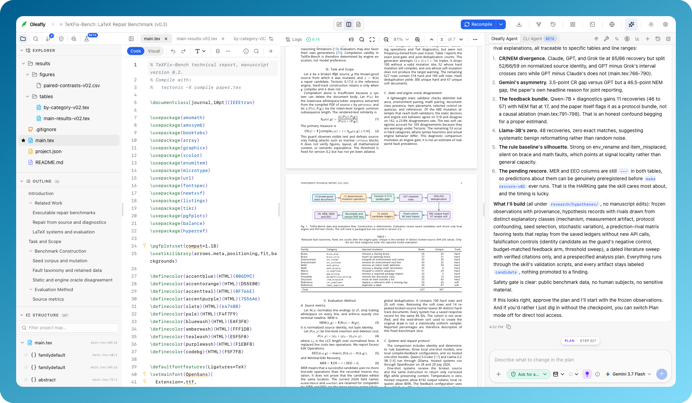
</div>

## 从这里开始

| 如果你正在…… | 从这里开始…… |
| --- | --- |
| 撰写论文或学位论文 | 可编辑的 LaTeX、Typst 或 Markdown 起始项目 |
| 将已有工作带到电脑上 | ZIP、GitHub 仓库、Word 或 HTML 文件、Typst 文档、arXiv 源码或 PDF 导入 |
| 使用 LaTeX、Typst 或 Markdown | 源文件编辑器、可视化编辑器、实时预览和引擎选择器 |
| 构建结构化手稿 | 项目大纲、跨文件搜索、引用导航和本地校对 |
| 查找资料或引文 | 引文搜索、文档支持扫描或本地书目导入 |
| 使用 AI | 内置助手、隔离的研究任务、CLI 代理或 MCP |
| 运行较长的研究任务 | 独立 worktree 或暂存副本、审阅结果和选择性文件应用 |
| 重用研究工作流 | 内置技能包、斜杠命令或自己保存的技能文件夹 |
| 制作图形或表格 | Diagram Composer、LaTeX Preview、Image to LaTeX 或 LaTeX Table Generator |
| 准备投稿 | 编译、引用、隐私、无障碍和投稿要求检查的 Preflight |
| 恢复或管理版本 | 用检查点进行本地恢复，用 Git 管理有意的历史和协作 |
| 关联论文、数据或分析 | 手稿旁边的只读研究文件夹 |
| 导出或转换文档 | PDF 和源代码 ZIP，以及支持的 Word、HTML、Markdown、文本、PPTX 或 EPUB 输出 |
| 查找本地工具链 | 内置 Tectonic 和 Typst，以及可选的系统 TeX 和 Pandoc |

<div align="center">
  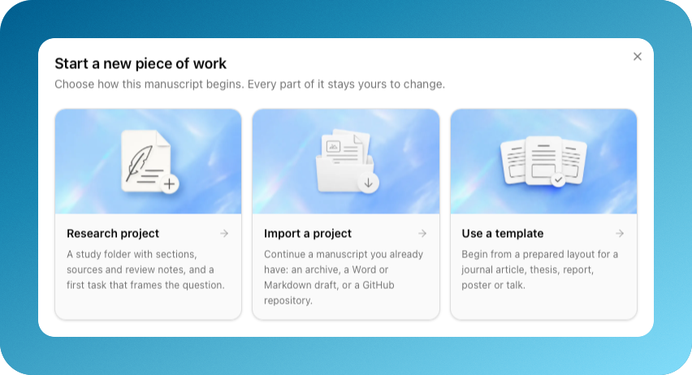
</div>
<p align="center"><em>从你实际拥有的工作类型开始：新研究项目、现有项目或模板。</em></p>

## 为什么选择 Oleafly

许多科研写作流程由一串互相分开的工具组成：编辑器、编译器、PDF 阅读器、文献管理器、制图工具、Git、投稿清单，以及一个可能看不到项目内容的 AI 聊天窗口。论证变复杂时，工作也被分散到越来越多的窗口里。

Oleafly 将这些工具围绕一个项目组织起来。源文件仍是普通文本，PDF 就在旁边。你可以从正在写的句子查找引文，将图形保留为 TikZ，并在助手改动进入项目之前先审阅它们。

### 三种工作方式

| 工作方式 | 它提供什么 | 你仍然需要解决什么 |
| --- | --- | --- |
| 托管云编辑器 | 快速开始、浏览器访问和托管服务 | 信任托管数据层，并适应服务本身的限制 |
| 自建本地工作流 | 控制文件、工具和基础设施 | 选择、安装、配置和维护每个组成部分 |
| Oleafly | 将编辑器、引擎、PDF、引文、图形、检查、Git 和可选代理放在一起的本地桌面工作空间 | 当前版本尚未提供实时共同编辑和后台跨设备同步 |

Oleafly 提供有引导的工作空间，同时不会把手稿锁进专有格式或永久服务中。

## 哪些内容留在你的电脑上

核心工作留在你的电脑上：项目文件、索引、使用本地引擎的编译、PDF 预览、拼写检查、语法检查、Preflight、Git 历史、检查点和终端。这些任务不需要账户。

应用只会为确实需要网络的操作访问网络，例如文献搜索、DOI 元数据、GitHub 操作、托管 AI、可选引擎和模板下载以及更新源。本地 Ollama 模型会让模型通信留在你的电脑上。服务不可用时，应用会显示离线或不可用状态。

| 默认留在本地 | 只有在你选择时才发生 |
| --- | --- |
| 项目源文件和元数据 | 文献和引文搜索 |
| 编辑器状态和项目索引 | GitHub 登录、推送、拉取和发布 |
| 所需软件包可用时用内置引擎编译 LaTeX | 托管 AI 服务 |
| Typst 编译 | 可选下载和更新检查 |
| PDF 渲染和文本检查 | Domain shelf 技能下载 |
| 拼写、语法和 Preflight 检查 | localhost 上的外部 MCP 客户端 |
| Git 历史和自动检查点 | |

<p align="center">
  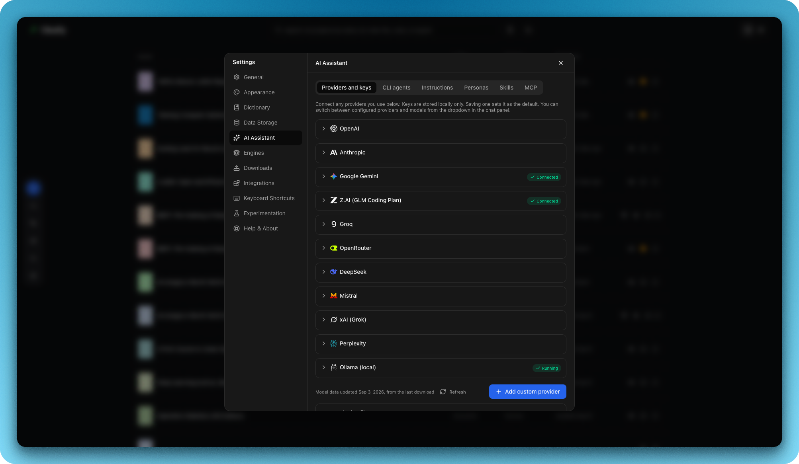
</p>
<p align="center"><em>提供商连接由你明确选择，并与磁盘上的手稿分开。</em></p>

## 从真实项目开始

### 可以编辑的模板

从文章、期刊论文、学位论文、文献综述、报告、书籍、Beamer 演示文稿、海报、作业、信件、书目、简历或图形开始。模板是普通的源代码项目，带有声明的引擎、主文档、文档类型、资源和预览元数据。创建项目之前，你可以先检查文件。

模板库可以按引擎、类别、离线准备状态和 ATS 适用性筛选。内置模板不需要模板账户。只有在你选择后，可选模板包、字体和资源才会下载。

<div align="center">
  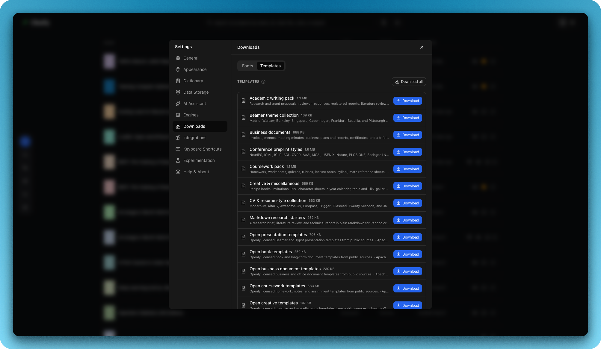
</div>

### 带入你已有的工作

导入项目 ZIP 或 GitHub 仓库，用 Pandoc 转换 DOCX，或将 PDF 作为可编辑 LaTeX 的起点。导入结果会成为本地项目文件，因此你可以检查结果，而原始来源保持不变。

PDF 重建是确定性的。应用会提取能够识别的文本、布局、公式和图形，报告它的限制，并留下可编辑的 LaTeX，而不是不透明的文档。如果你连接了支持视觉的提供商，它之后还可以帮助完善导入的项目。

<p align="center">
  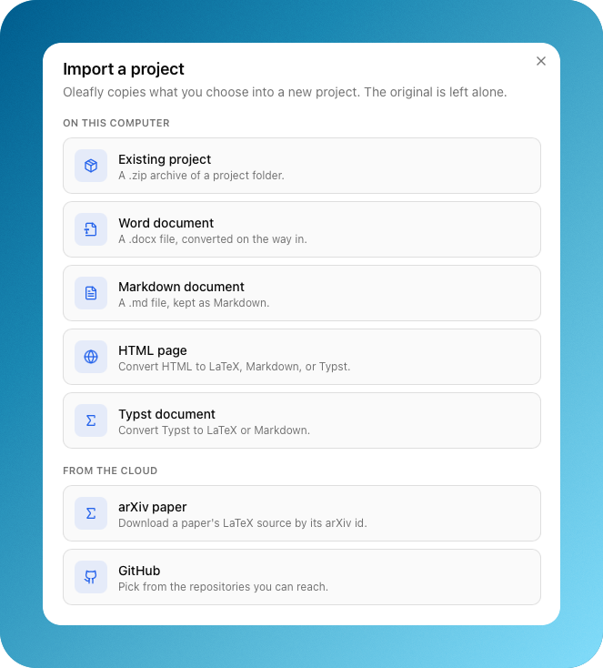
</p>
<p align="center"><em>将已有项目或文档带入普通的本地工作空间。</em></p>

### 每个项目都是磁盘上可访问的文件夹

Oleafly 的项目库跟踪项目身份、引擎、文档类型、书签、预览状态和历史。手稿本身仍是普通目录，可以在其他编辑器中打开，在终端中检查，与合作者共享，或使用普通 Git 提交。Oleafly 不需要专有文档数据库来编译你的工作。

应用自己的构建产物和本地元数据与源文件分开保存。项目可以在 `project.json` 中保存引擎和主文档选择，因此克隆或导出的源代码压缩包也能使用相同的项目设置打开。

<div align="center">
  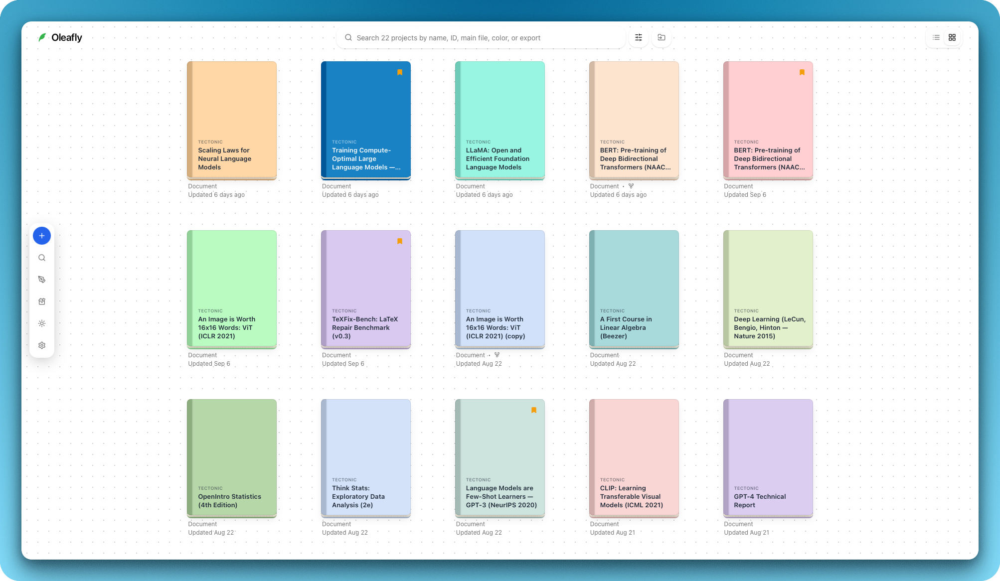
</div>

## 写作并保持文档结构

### 面向结构化文档的源文件编辑器

CodeMirror 编辑器由项目级索引支持。索引覆盖手稿中的标题、标签、引用键、宏、环境、被包含文件和编译诊断。

在 LaTeX、Typst、Markdown 和 BibTeX 中，你可以使用：

- 面向引擎的语法高亮，覆盖命令、环境、数学、注释、标记语言和书目条目。
- LaTeX 命令、环境、标签、引用键和项目文件路径补全。
- 语法、编译错误、未定义引用、重复键、重复标签和断裂引用的实时诊断。
- 带有符号、标签、引文、宏和文件关系的本地及全局文档大纲。
- 搜索和替换、代码折叠、多文件标签页、Vim 模式、字数统计、斜杠命令插入和可配置快捷键。
- LaTeX 结构助手，用于 `\item`、`\begin` / `\end`、环境、数学分隔符、图注和常用插入模式。
- 编译后的标签编号和页码悬停提示、公式预览，以及 `\includegraphics` 目标的图像缩略图。

### 插入 LaTeX 块、格式和符号

LaTeX 工具栏让常用结构触手可及，同时把源文件控制权留在你手中。你可以在 Code 和 Visual 视图之间切换，撤销或重做，选择标题级别，设置文字格式，插入引用，创建表格或图形，而不必记住每一条命令。

<div align="center">
  
</div>
<p align="center"><em>从工具栏插入常见 LaTeX 结构，再继续直接编辑源文件。</em></p>

| 区域 | 可用控件 |
| --- | --- |
| 编辑和视图 | Code 视图、Visual 视图、撤销、重做 |
| 文档结构 | 插入六级标题：`\part`、`\chapter`、`\section`、`\subsection`、`\subsubsection`、`\paragraph` |
| 行内格式 | 粗体 `\textbf{}`、斜体 `\textit{}`、下划线 `\underline{}`、行内代码 `\texttt{}` |
| 引用和注释 | 链接 `\href{}{}`、项目引文、交叉引用 `\ref{}`、脚注 `\footnote{}` |
| 内容块 | `quote` 块引用、带 `\includegraphics` 的图形、图注和标签、可选择行列的可视化表格、项目符号 `itemize` 列表、有序 `enumerate` 列表 |
| 数学块 | `equation`、`align` 和分数 `\frac{}{}` 插入 |
| AI 辅助插入 | 在配置支持视觉的提供商后，将图像中的公式、表格或可见文本转换为 LaTeX |
| 代码智能 | 跳转到定义、查找引用和项目级符号重命名 |

### 可搜索的 LaTeX 符号面板

符号选择器的 **All** 视图包含 236 个不重复命令。分类列表包含 238 个条目，因为 `\nabla` 和 `\partial` 同时适用于运算符和微积分。按符号名称或 LaTeX 命令搜索，然后在光标处插入。

| 类别 | 数量 | 可用符号和命令 |
| --- | ---: | --- |
| 小写希腊字母 | 29 | `\alpha`, `\beta`, `\gamma`, `\delta`, `\epsilon`, `\varepsilon`, `\zeta`, `\eta`, `\theta`, `\vartheta`, `\iota`, `\kappa`, `\lambda`, `\mu`, `\nu`, `\xi`, `\pi`, `\varpi`, `\rho`, `\varrho`, `\sigma`, `\varsigma`, `\tau`, `\upsilon`, `\phi`, `\varphi`, `\chi`, `\psi`, `\omega` |
| 大写希腊字母 | 11 | `\Gamma`, `\Delta`, `\Theta`, `\Lambda`, `\Xi`, `\Pi`, `\Sigma`, `\Upsilon`, `\Phi`, `\Psi`, `\Omega` |
| 运算符 | 19 | `+`, `-`, `\times`, `\div`, `\cdot`, `\pm`, `\mp`, `\ast`, `\star`, `\circ`, `\bullet`, `\oplus`, `\ominus`, `\otimes`, `\odot`, `\dagger`, `\ddagger`, `\nabla`, `\partial` |
| 关系 | 21 | `=`, `\neq`, `<`, `>`, `\leq`, `\geq`, `\ll`, `\gg`, `\approx`, `\sim`, `\simeq`, `\cong`, `\equiv`, `\propto`, `\prec`, `\succ`, `\preceq`, `\succeq`, `\perp`, `\parallel`, `\mid` |
| 箭头 | 23 | `\leftarrow`, `\rightarrow`, `\uparrow`, `\downarrow`, `\leftrightarrow`, `\Leftarrow`, `\Rightarrow`, `\Uparrow`, `\Downarrow`, `\Leftrightarrow`, `\mapsto`, `\longmapsto`, `\longrightarrow`, `\longleftarrow`, `\hookrightarrow`, `\hookleftarrow`, `\nearrow`, `\searrow`, `\nwarrow`, `\swarrow`, `\rightleftharpoons`, `\leftharpoonup`, `\rightharpoonup` |
| 集合论 | 19 | `\in`, `\notin`, `\ni`, `\subset`, `\supset`, `\subseteq`, `\supseteq`, `\cup`, `\cap`, `\bigcup`, `\bigcap`, `\setminus`, `\emptyset`, `\varnothing`, `\mathbb{N}`, `\mathbb{Z}`, `\mathbb{Q}`, `\mathbb{R}`, `\mathbb{C}` |
| 逻辑 | 16 | `\forall`, `\exists`, `\nexists`, `\neg`, `\land`, `\lor`, `\wedge`, `\vee`, `\implies`, `\iff`, `\therefore`, `\because`, `\top`, `\bot`, `\vdash`, `\models` |
| 微积分 | 18 | `\int`, `\iint`, `\iiint`, `\oint`, `\sum`, `\prod`, `\coprod`, `\lim`, `\infty`, `\nabla`, `\partial`, `\sqrt{}`, `\frac{}{}`, `\binom{}{}`, `\sup`, `\inf`, `\max`, `\min` |
| 函数 | 19 | `\sin`, `\cos`, `\tan`, `\cot`, `\sec`, `\csc`, `\arcsin`, `\arccos`, `\arctan`, `\sinh`, `\cosh`, `\tanh`, `\log`, `\ln`, `\exp`, `\det`, `\dim`, `\ker`, `\arg` |
| 括号 | 16 | `(`, `)`, `[`, `]`, `\{`, `\}`, `\langle`, `\rangle`, `\lfloor`, `\rfloor`, `\lceil`, `\rceil`, 竖线字符, `\|`, `\left( \right)`, `\left[ \right]` |
| 重音 | 14 | `\hat{}`, `\bar{}`, `\tilde{}`, `\vec{}`, `\dot{}`, `\ddot{}`, `\acute{}`, `\grave{}`, `\breve{}`, `\check{}`, `\overline{}`, `\underline{}`, `\overbrace{}`, `\underbrace{}` |
| 点和间距 | 13 | `\cdots`, `\ldots`, `\vdots`, `\ddots`, `\quad`, `\qquad`, `\,`, `\;`, `\!`, `\text{}`, `\mathrm{}`, `\mathbf{}`, `\mathcal{}` |
| 其他 | 20 | `\hbar`, `\ell`, `\wp`, `\Re`, `\Im`, `\aleph`, `\angle`, `\triangle`, `\diamond`, `\square`, `\lozenge`, `\clubsuit`, `\diamondsuit`, `\heartsuit`, `\spadesuit`, `^{\circ}`, `\#`, `\$`, `\%`, `\&` |

<div align="center">
  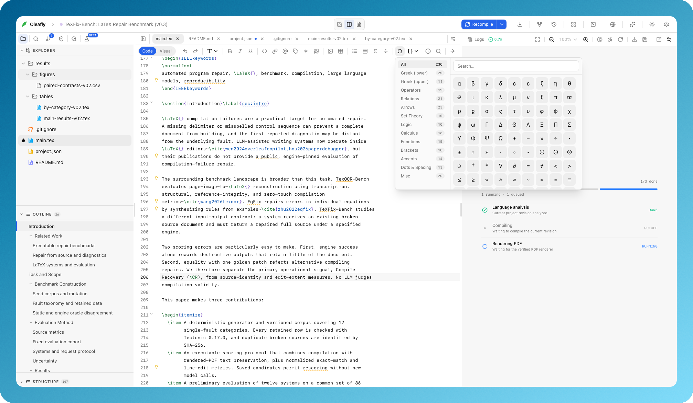
</div>
<p align="center"><em>按类别或名称搜索 236 个不重复的 LaTeX 命令，并在需要的位置插入它。</em></p>

<div align="center">
  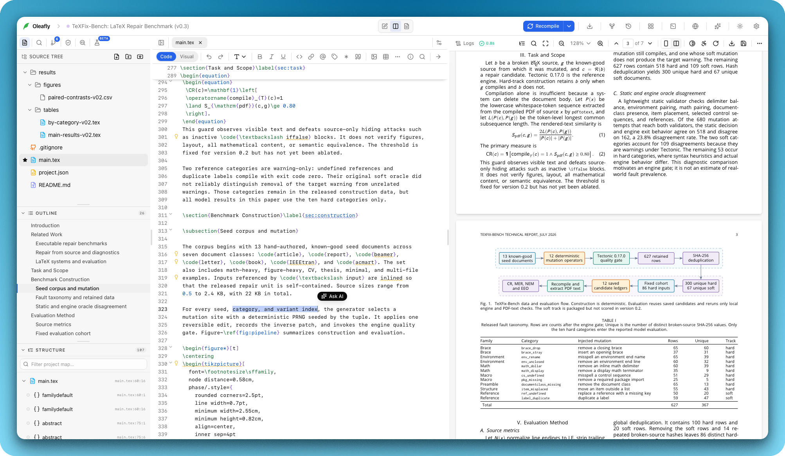
</div>

### 源文件视图和可视化视图

源文件视图是规范表示形式。引擎支持时，可以为 LaTeX 或 Markdown 打开可视化编辑器，在页面化界面中编辑文字、公式、引文、表格和图形。源文件始终可供 Git、外部编辑器和手动编辑使用。

页面级编辑适合使用可视化视图。需要精确控制命令、宏包、环境或版式时，返回源文件视图。

<p align="center">
  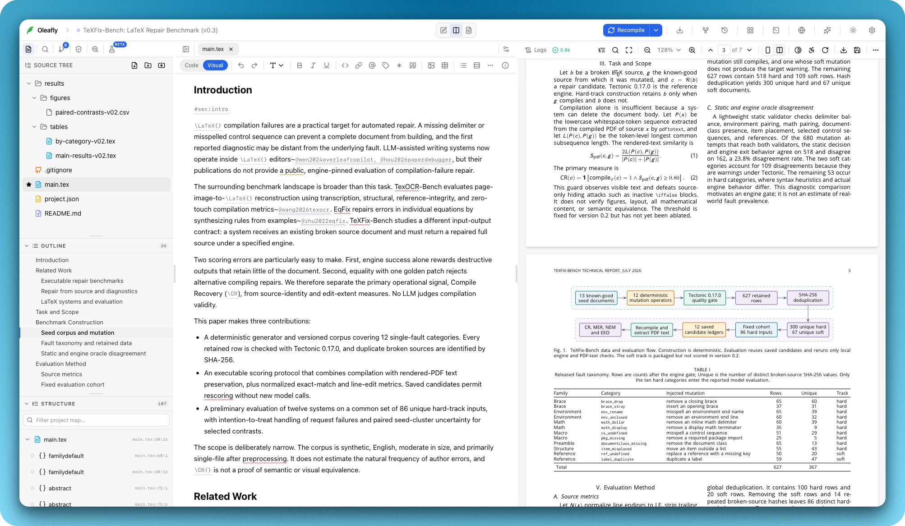
</p>

### 在本地校对正文

Hunspell 使用选定的词典包以及个人或项目词条进行拼写检查。Harper 通过面向文档的正文掩码检查语法和风格，因此命令、注释、数学内容和机器参数不会被当作普通英语句子处理。

学术配置会避开与学术写作冲突的规则，每条发现都提供本地操作：替换、对项目忽略、对本次会话忽略，或在设置中调整规则。校对在本地运行，不需要 AI 提供商。

### 搜索整个项目

从侧栏或命令面板搜索整个项目。项目索引连接源文件、标题、标签、引文、宏和被包含文件，让多文件学位论文比一堆编辑器标签更容易导航。

## 使用 LaTeX、Typst 或 Markdown 编译

Oleafly 将编译放在手稿旁边，并把编译器输出转换为与源文件关联的诊断。每个项目选择自己的引擎，编辑器、预览、SyncTeX、Preflight 和导出控件都遵循该引擎的实际能力。

| 引擎 | 适合什么 | 重要细节 |
| --- | --- | --- |
| 使用 Tectonic 的 LaTeX | 便携、内置的 LaTeX 构建 | 随桌面应用提供；支持多文件项目、图像、引文、Biber、SyncTeX、独立图形编译，以及宏包可用时的缓存离线构建 |
| 使用 `latexmk` 的 LaTeX | 需要完整系统 TeX 发行版的项目 | 使用 MacTeX、TeX Live、MiKTeX 或 TinyTeX；支持 `minted`、`glossaries`、`makeidx`、PythonTeX、重度 shell-escape 模板和明确受信任的 Unicode 引擎 |
| Typst | 快速的现代文档写作 | 内置编译器、PDF 输出、项目索引和引文；当前版本不提供 SyncTeX、离线编译模式或独立图形编译 |
| 使用 Pandoc 的 Markdown | 轻量写作和转换工作流 | Pandoc 可从设置中安装；PDF 输出使用内置 Tectonic，并在支持时提供 DOCX、HTML、Markdown 和文本导出 |

LaTeX 项目打开时会进行兼容性扫描。如果项目超出内置引擎的能力，Oleafly 会说明差距，并指向适合的引擎或宏包。系统 TeX 默认使用受限 shell 命令；如有需要，可以为每个项目和每台电脑分别启用完整 shell escape。

内置 Biber sidecar 与 Tectonic 使用的 biblatex 版本匹配。编译日志会区分缺少 Biber 可执行文件、版本不匹配和普通 LaTeX 错误，帮助你选择正确的修复方式。

<div align="center">
  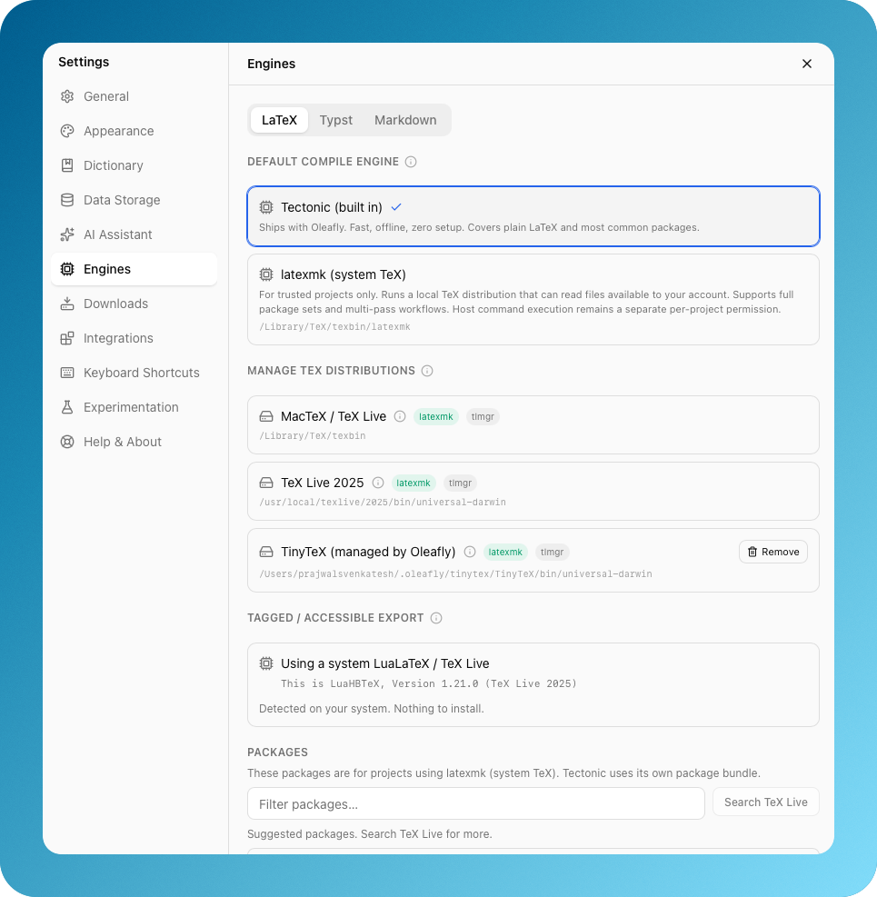
</div>

## 在源文件旁阅读 PDF

PDF 查看器内置在工作空间中，也可以在独立预览窗口中打开。较新的编译正在运行或失败时，它仍会保留最后一次接受的 PDF，因此一次错误编辑不会抹去上一个可读结果。

你可以使用连续滚动或单页、双页模式。还可以缩放、适应宽度或高度、旋转、反色、搜索文档文本、跟随大纲、跳转页面、使用指定文件名下载，或在同一个界面查看编译日志。加密 PDF 会显示密码提示，而不是空白查看器。

存在有效 SyncTeX 数据时，可以从源文件跳转到 PDF，也可以从 PDF 点击位置返回源文件。无法提供 SyncTeX 的引擎会关闭这些控件。

<div align="center">
  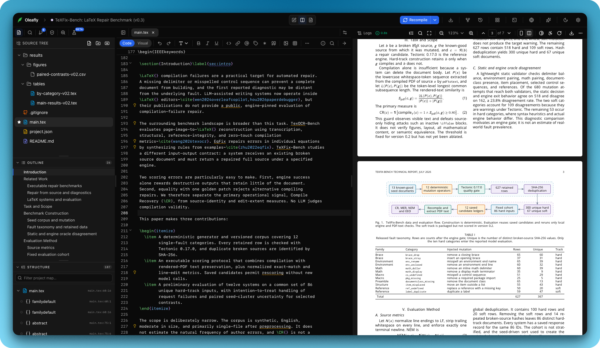
</div>

## 文献与引文

### 从正在写的句子开始搜索

引文搜索会在一个界面中查询 arXiv、Semantic Scholar、Crossref、PubMed 和 OpenAlex。它会合并重复结果，保留元数据，并让你将参考文献保存到本地文献库。

你也可以按 DOI、arXiv ID、URL 或标题查找引文。从 Zotero RDF、EndNote XML、RIS 或 BibTeX 导入现有文献库。项目索引提供引文键补全、参考文献导航、悬停详情，以及未定义引文、重复键、重复 DOI 和不完整书目元数据的诊断。

### 扫描文档，查找缺少支持的论述

在文档模式中，Oleafly 会将当前选区或手稿拆分为正文段落，搜索配置的文献来源，排除已经在书目中的论文，并按 0 到 100 分排序。AI 提供商可以补充简短的支持 / 反对理由。关闭 AI 时，扫描使用本地启发式排序。

你可以将结果保存到本地文献库，复制 BibTeX，或将选定条目追加到项目书目并插入引文。

### 用两种声音审阅论文

审阅模式可以使用配置好的 AI 提供商，以两种风格阅读当前文档或捕获的选区：

- Friendly：先说明优点，再给出具体、建设性的建议。
- Fire：严格模拟 Reviewer #2，压力测试主张、方法和证据。

审阅是可选的助手操作，不能替代投稿要求或人类合作者。

### 将研究文件夹放在手稿旁边

关联数据集、来源库、分析文件夹或其他研究目录，而不必把它们移入项目。Oleafly 只读取这些关联文件夹，不会写入其中。它们不会参与编译、项目搜索或 Git；路径不可用时会显示明确的缺失或不可读状态。

### 搜索实验室和截止日期

工具库中的 Lab Search 使用 OpenAlex 列出的研究机构，并提供国家筛选以及机构、ROR 和 OpenAlex 记录链接。Conference Deadlines 提供可搜索的计算机科学会议字段和倒计时，数据来自内置截止日期目录。

## 图形、公式和表格

### Diagram Composer

在画布上使用矩形、圆形、椭圆、菱形、文本、连接线、吸附、填充和边框颜色、撤销、重做、小地图以及明暗画布绘制图形。切换到 TikZ 代码，插入片段，单独编译图形，并在源文件旁预览。

保存的 `.tikz` 源文件保留图形模型，方便再次编辑。插入结果时可以选择 TikZ 或生成图像，并添加图注和标签。可选的 AI 修复可以帮助处理图形编译错误，支持视觉的模型也可以检查渲染结果并调整布局。

<div align="center">
  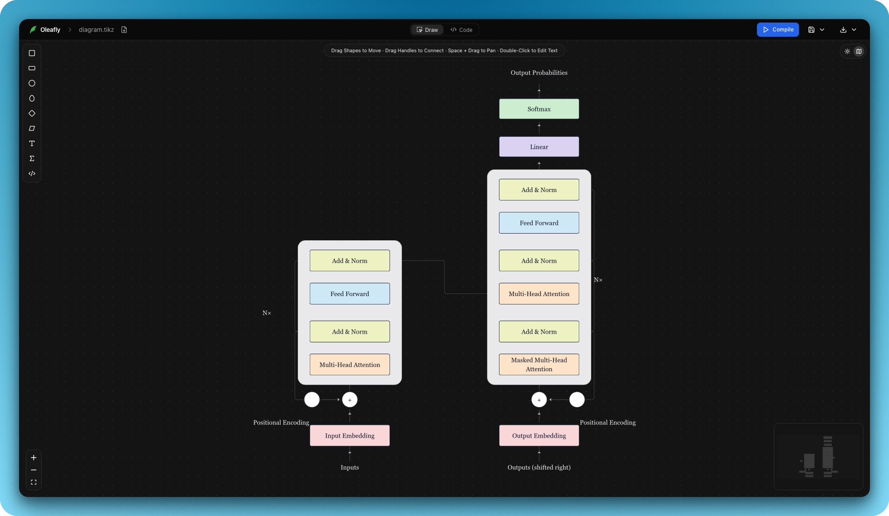
</div>

### 公式和表格输出

LaTeX to Image 工具会渲染公式并导出 PNG 或 SVG，也可以为 Word 复制 MathML 或 KaTeX HTML。Table to LaTeX 工具提供可视化行列编辑器，并导出普通 LaTeX。配置支持视觉的提供商后，Image to LaTeX 可以从图像中转写公式、表格或可见文本。

这些工具可以从工具库、命令面板以及应用显示的斜杠命令中使用。

<div align="center">
  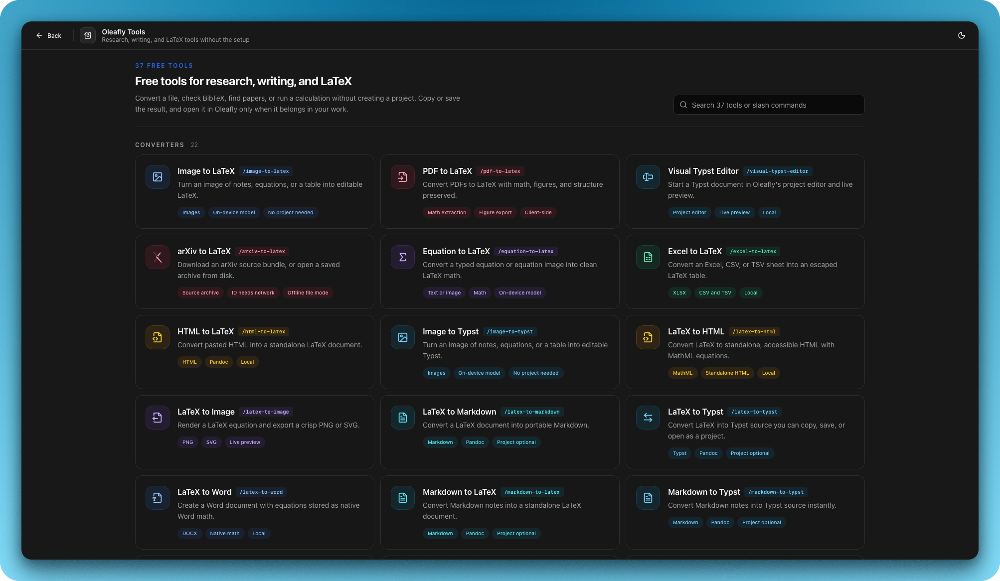
</div>

## 在文档离开电脑前检查它

Preflight 会读取源文件、项目结构、编译器日志和当前 PDF，将发现按问题分组，并显示每个结果的来源。检查可以一起或分别运行；缺少输入时会显示为不可用或部分完成，而不会被算作通过。

| 检查 | 检查内容 |
| --- | --- |
| 编译和版式 | 构建失败、未解决的引文和引用、重复运行警告、缺少字形、溢出盒、被裁剪文本、重复 PDF 目标和混合页面尺寸 |
| 投稿准备 | 文档类、摘要、关键词、图形格式、嵌入字体、PDF 版本和限制、可移植文件名、图注和干净的源文件打包 |
| ATS 准备 | 简历文本提取、联系字段、预期章节、页数和容易打乱申请人跟踪系统的版式 |
| 无障碍 | 标签、替代文本、文档语言和标题、查看器设置、标题和表格结构、链接说明、阅读顺序、可选文本、书签和过小文字 |
| 引用和资源 | 缺少文件、未定义引文和引用、重复标签和 DOI、不完整书目字段、未引用条目和缺少图形 |
| 隐私和匿名评审 | 凭据、私钥、敏感文件、草稿标记、内部注释、作者字段、致谢和 PDF 身份元数据 |

出版配置文件覆盖一般出版、arXiv、IEEE、ACM、其他期刊和学位论文。页边距、页数、文件大小规则和投稿说明仍应以投稿 venue 当前的作者指南为准。

无障碍检查参考 PDF/UA、Matterhorn 和 WCAG，并报告 PDF/UA-1 中可由机器检查的部分。符合条件时，无障碍导出准备可以添加 LaTeX 元数据、表头声明和替代文本占位符。

Preflight 是机器检查集合，不是符合性证书。它无法判断替代文本是否有意义、阅读顺序是否合理或对比度是否足够。如需正式的无障碍符合性声明，请使用投稿 venue 要求的工具验证最终 PDF。

<div align="center">
  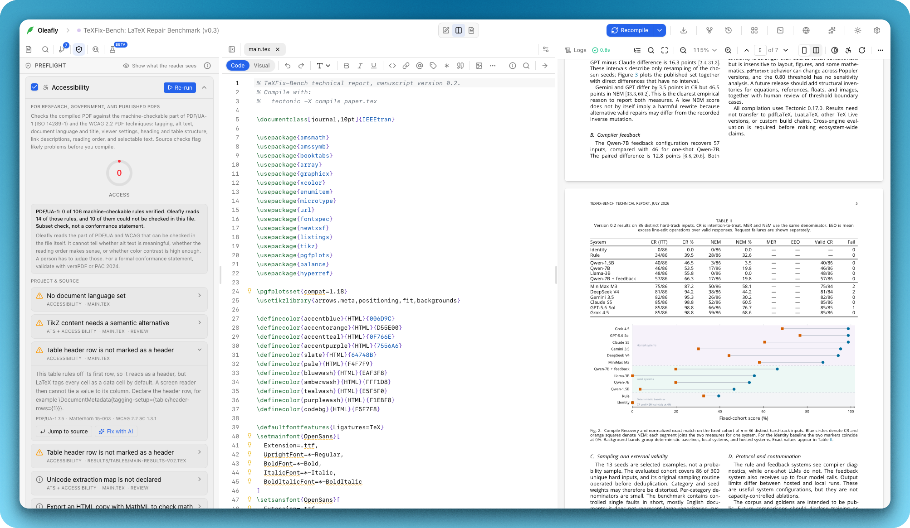
</div>
<p align="center"><em>在投稿前查看可由机器检查的无障碍问题，但不要把它误认为符合性声明。</em></p>

## 管理版本并恢复工作

### 像平常一样使用 Git 仓库

Oleafly 使用普通 Git 仓库。Source Control 面板可以初始化仓库，显示统一或并排 diff，暂存文件，丢弃更改，提交、推送、拉取，并显示远程的领先或落后状态。你也可以将项目发布到 GitHub 或连接现有仓库。

保存、编译或关闭项目都不会创建提交。Oleafly 不会把源文件藏在终端之外，也不会为了隐藏自己的元数据而修改项目的 `.gitignore`。

<p align="center">
  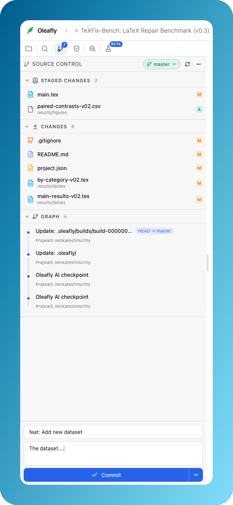
</p>
<p align="center"><em>无需离开项目即可查看暂存更改、分支、历史和提交。</em></p>

### 用检查点快速恢复

成功编译后，Oleafly 可以保存项目的本地快照。检查点不会初始化仓库、创建提交或改变分支。你可以事务性地恢复旧状态，为重要版本添加标签，检查已保存文件，清理旧历史，或在加密归档中移动完整历史。

有意创建提交、分支、远程和协作时使用 Git。论文快速变化时，用检查点进行本地快速恢复。

<div align="center">
  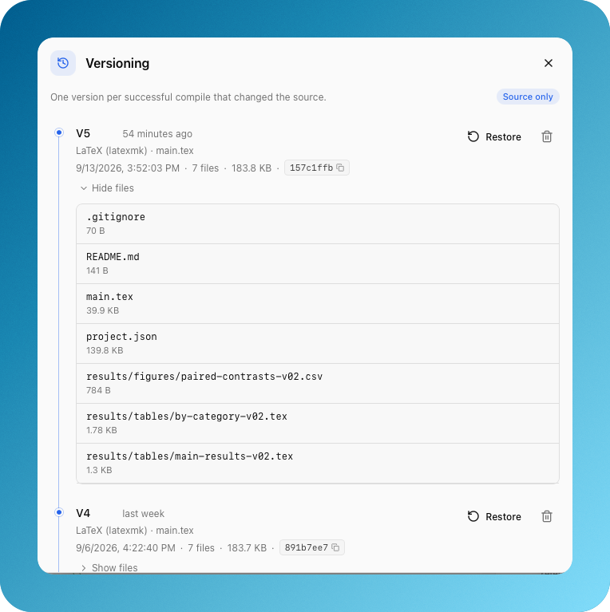
</div>

## AI 是可选的

关闭 AI 时，编辑器、编译器、PDF 预览、引文、校对和 Preflight 仍然可用。启用 AI 后，它使用与应用其他部分相同的项目文件和工具。

### 让助手了解打开的项目

配置提供商后，助手可以：

- 在回答前读取项目文件或搜索项目。
- 解释章节、公式、引文或编译错误。
- 修改正文、创建文件、重命名文件和进行有针对性的替换。
- 编译项目、读取日志、提取 PDF 文本，并在启用 PDF 捕获后检查渲染页面。
- 搜索文献、验证 DOI、添加引文，并映射文档的标题、标签、引文、宏和文件关系。
- 起草、编译、检查、修复和插入可编辑的 TikZ 或 PGFPlots 图形。

每次文件改动都会生成可见 diff。设置可以要求每项操作都获得批准，也可以允许本次会话的普通写入，或选择较少交互的模式。Plan 模式会先绘制项目地图，之后才允许助手写入、编译或运行命令。

你可以连接托管提供商、OpenAI 兼容端点或本地 Ollama 模型。提供商凭据保存在应用管理的加密存储中，不会写入项目文件。应用会说明你选择的操作何时会发起托管请求。

<div align="center">
  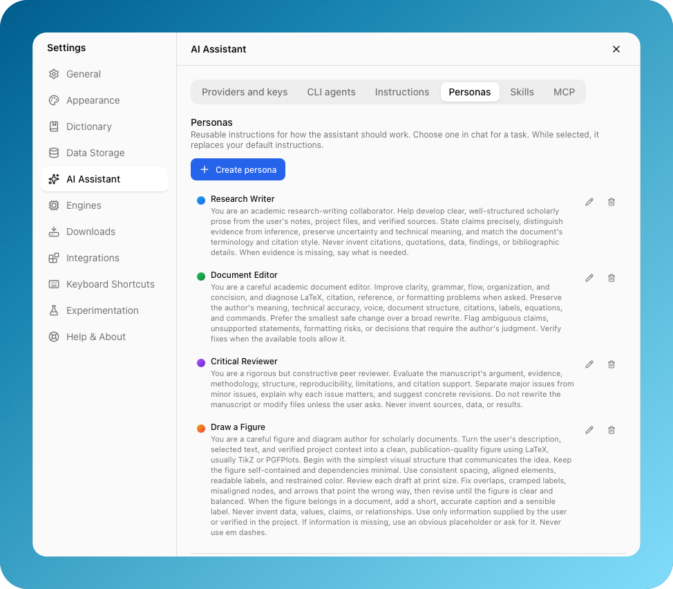
</div>
<p align="center"><em>根据手头的任务选择角色，从研究写作、文档编辑到批判性审阅和图形工作。</em></p>

<details>
<summary>应用前查看编辑建议</summary>

在请求批准模式下，阅读建议的文件 diff，并选择要应用的更改。普通写入可以在本次会话中批准；删除操作会单独显示，并可能需要明确确认。

</details>

### 将较长的研究任务单独运行

为文献综述、证据审计、分析、手稿修订或回复审稿人启动任务。任务会在独立 Git worktree 或暂存副本中运行，你可以继续在原项目中工作。

任务完成后，检查活动、输出和每一个更改文件。预览 diff，选择值得保留的文件，只应用这些文件。原项目在你应用经过审阅的结果之前不会改变。如果任务运行期间项目发生变化，Oleafly 会检测漂移，而不是把旧 diff 覆盖到较新的工作上。

### 使用目录中的 CLI 代理

目录包含 14 个 CLI 代理。每个代理使用自己的账户、权限和模型配置；Oleafly 提供项目上下文和周围的工作空间。

| 代理 | 命令 |
| --- | --- |
|  Claude Code | `claude` |
|  Codex CLI | `codex` |
|  Gemini CLI | `gemini` |
|  Pi | `pi` |
|  OpenCode | `opencode` |
|  OpenClaw | `openclaw` |
|  Cline | `cline` |
|  Hermes Agent | `hermes` |
|  CodeBuddy | `codebuddy` |
|  Kimi Code | `kimi` |
|  Grok Build | `grok` |
|  Cursor | `agent` |
|  DeepSeek Harness | `dsh` |
|  Qoder | `qodercli` |

<small>这些标志用于识别兼容工具，归其各自所有者所有，不表示任何背书。</small>

打开对话，在需要时通过代理自己的 CLI 登录，重新连接，查看工具活动，指导运行中的任务，停止任务，并在支持时将记录保留在项目会话中。

CLI 代理支持处于 beta 阶段。设置会显示每个代理的安装准备状态、平台限制和恢复支持情况。

### 重用研究工作流和技能

Oleafly 提供用于文献、写作、图形、审阅、投稿、交流和工具操作的技能。技能是遵循 Agent Skills 结构的普通 `SKILL.md` 文件夹。

你可以用斜杠命令运行技能，添加自己的文件夹，从已完成的对话保存可重复的研究流程，或从领域技能库安装技能。技能也可以与同一台电脑上兼容的 CLI 代理共享。已经安装的技能可以继续离线工作。

### Oleafly 随附的技能

内置的 `research-core` 软件包包含 36 个技能。下面的名称是目录和项目设置中使用的 ID。

| 类别 | 技能 |
| --- | --- |
| 研究和文献 | `citation-management`, `exploratory-data-analysis`, `hypothesis-generation`, `literature-review`, `oleafly-literature-sweep`, `oleafly-research-loop`, `openresearch`, `paper-lookup`, `research-lookup`, `scientific-brainstorming`, `scientific-critical-thinking` |
| 手稿写作和分析 | `experimental-design`, `oleafly-data-analysis`, `oleafly-manuscript-scaffold`, `oleafly-related-work`, `scientific-writing`, `statistical-analysis`, `statistical-power`, `venue-templates` |
| 图形和可视化 | `oleafly-figure-prep`, `scientific-schematics`, `scientific-visualization` |
| 审阅和证据 | `oleafly-response-letter`, `oleafly-review-manuscript`, `oleafly-verify-claims`, `peer-review`, `scholar-evaluation` |
| 投稿 | `oleafly-pre-submission` |
| 交流 | `oleafly-slides-and-posters`, `pptx-posters`, `research-grants`, `scientific-slides` |
| 导入和构建工具 | `import-refine`, `oleafly-latex-build`, `pdf-to-latex`, `template-generate` |

<p align="center">
  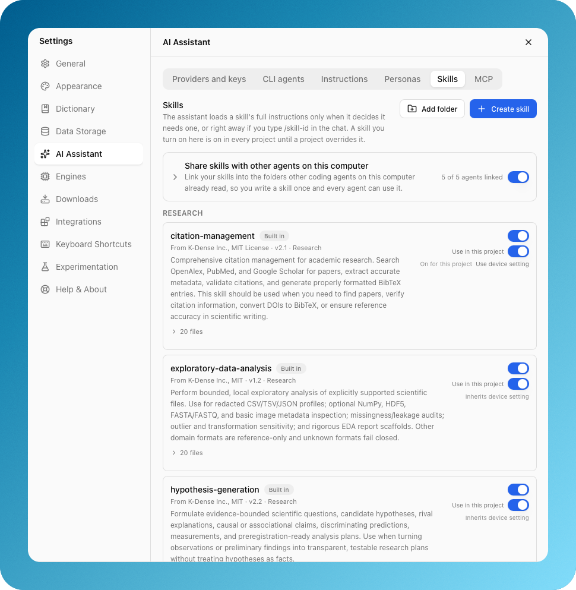
</p>
<p align="center"><em>把有用的研究流程变成可以重用并与兼容代理共享的技能。</em></p>

### 通过 MCP 连接外部 AI 客户端

Oleafly 可以为外部客户端运行本地 MCP 服务器。它向内置助手公开相同的项目工具：列出和读取文件、搜索项目、检查项目地图、编译、读取日志、提取 PDF 文本、预览图形，以及按照 Oleafly 的批准策略应用编辑。

服务器只绑定到 `127.0.0.1`，使用短期 bearer token，并且只在 Oleafly 进程打开期间运行。只读模式会从工具列表中移除修改工具。外部客户端自带模型，因此通过此路径不需要在 Oleafly 中填写 AI API 密钥。

## 工具库

从全局搜索栏或命令面板打开工具库。按名称、描述或斜杠命令搜索。需要网络或 AI 提供商的工具会在自己的面板中说明。

### 面向整个工作空间的命令面板

在一个位置搜索项目和文档，打开设置，创建项目，切换主题，或启动工具。输入 `/` 可缩小到命令列表，写作时不必离开键盘。

<p align="center">
  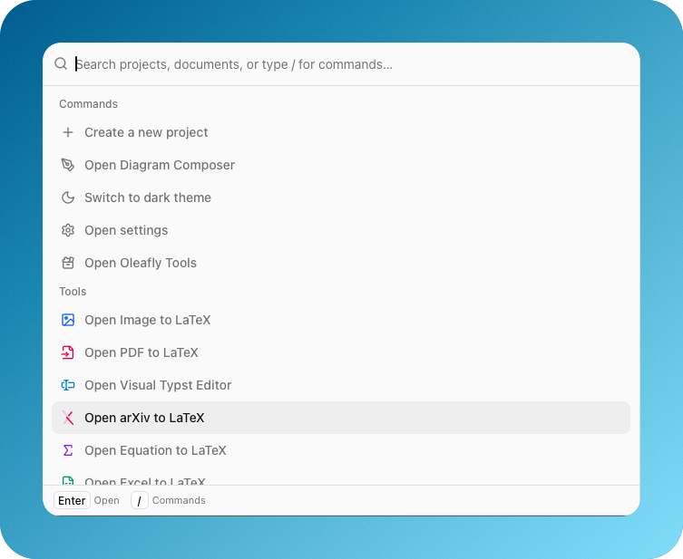
</p>

### 导入和格式转换

| 工具 | 用途 |
| --- | --- |
| PDF to LaTeX | 从 PDF 重建可编辑的 LaTeX，在来源允许时保留公式、图形和结构 |
| arXiv to LaTeX | 按 ID 下载 arXiv 源码包，或从磁盘解包已保存的归档 |
| Image to LaTeX | 将笔记、公式或表格图像转换为可编辑 LaTeX |
| Equation to LaTeX | 将输入的数学内容或公式图像转换为 LaTeX |
| Excel to LaTeX | 将 Excel、CSV 或 TSV 表格转换为经过转义的 LaTeX 表格 |
| HTML to LaTeX | 将粘贴的 HTML 转换为独立 LaTeX 文档 |
| Image to Typst | 将笔记、公式或表格图像转换为可编辑 Typst |
| LaTeX to HTML | 将 LaTeX 转换为带 MathML 公式的独立 HTML |
| LaTeX to Image | 渲染公式并导出 PNG 或 SVG |
| LaTeX to Markdown | 将 LaTeX 文档转换为可移植 Markdown |
| LaTeX to Typst | 将 LaTeX 转换为可以复制、保存或打开为项目的 Typst 源码 |
| LaTeX to Word | 创建带原生 Word 数学公式的 DOCX |
| Markdown to LaTeX | 将 Markdown 笔记转换为独立 LaTeX 文档 |
| Markdown to Typst | 将 Markdown 笔记转换为 Typst 源码 |
| Mermaid to LaTeX | 将 Mermaid 流程图转换为可编辑 TikZ 代码 |
| PDF to Markdown | 将 PDF 文本层、公式和图形提取到 Markdown |
| PDF to Typst | 将 PDF 文本层、公式和图形提取到 Typst |
| Table to LaTeX | 在可视化行列编辑器中创建 LaTeX 表格 |
| Typst Editor | 创建带源文件编辑、实时预览和 PDF 导出的 Typst 项目 |
| Visual Typst Editor | 在项目编辑器中启动带实时预览的 Typst 文档 |
| Typst to LaTeX | 将 Typst 标记转换为用于期刊和投稿的 LaTeX |
| Word to LaTeX | 将 Word 文档转换为 LaTeX，并保留提取出的媒体文件 |

### 数学、表格、写作和验证

| 工具 | 用途 |
| --- | --- |
| BibTeX Validator | 检查 `.bib` 文件的语法错误、缺少字段和重复键 |
| Statistics Calculators | 在本地计算 p 值、样本量和置信区间 |
| Writing Generators | 根据打开的文档准备摘要、总结、改写或学位论文提纲 |
| Symbol Reference | 浏览 LaTeX 符号，并在当前光标处插入符号 |

### 文献、参考资料和研究

| 工具 | 用途 |
| --- | --- |
| Find Citations | 搜索学术索引，扫描草稿中缺少的支持，并导出 BibTeX |
| arXiv Citation Generator | 查找 arXiv 论文，并按八种格式生成引文 |
| Bibliography Generator | 根据结构化详情或 BibTeX 创建、验证、排序和导出书目 |
| Citation Generator | 将文章详情或学术标识符转换为格式化引文和 BibTeX |
| Citation Generators by Style | 比较 APA、MLA、Chicago、IEEE、Harvard、Vancouver、AMA 和 ACS 格式 |
| DOI to BibTeX | 获取 DOI 记录，检查字段，并导出 BibTeX |
| ISBN to BibTeX | 获取 ISBN 书籍元数据，修正后导出 BibTeX |
| PubMed to BibTeX | 根据 PMID 获取并检查 PubMed 记录，然后导出 BibTeX |
| URL to BibTeX | 识别 DOI、arXiv 和 PubMed 链接，或创建可编辑网页引文 |
| Lab Search | 在 OpenAlex 目录中查找研究机构 |
| Conference Deadlines | 筛选计算机科学会议截止日期并查看倒计时 |

公式工作区还可以导出 PNG、SVG、用于 Word 的 MathML 或 KaTeX HTML。表格输出仍是普通 LaTeX。Writing Generators 会为配置好的助手准备提示词，本身不提供模型。

命令面板还提供重新编译、自动编译、SyncTeX、PDF 导出、清理构建缓存、字数统计、Git 历史、检查点、终端、引文插入、格式助手、环境助手、主题控件、Vim 模式、拼写检查和离线模式。

## 在论文旁边使用终端

在不离开工作空间的情况下，为当前项目打开 shell 标签页。每个项目最多可以打开十个终端会话。你可以重命名和设置标签颜色，关闭一个或多个会话，并让这些标签名称随项目保存。

可以使用标签页运行脚本、检查数据集、查看生成文件或使用其他 CLI 工具。它就是你的 shell，命令可以访问你选择的同一个项目目录。

<p align="center">
  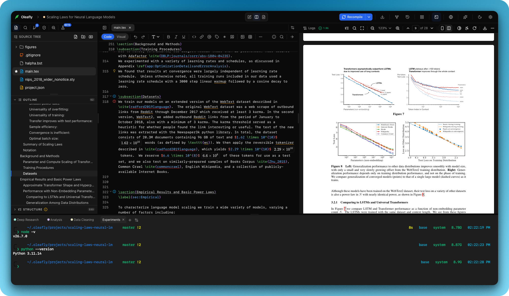
</p>
<p align="center"><em>在不离开编辑器和 PDF 工作空间的情况下，在终端标签页中运行项目命令。</em></p>

## 用于 computer-use 任务的浏览器

内置浏览器是独立的系统窗口，带有标签页、地址栏、导航控件和隔离的内容 webview。它主要用于 computer-use：代理可以打开 URL 并等待页面加载，而你继续在主窗口中处理手稿。

computer-use 工具不能读取、捕获、点击或脚本化页面内容。远程页面不会获得 Oleafly IPC 访问权，外部导航遵循当前批准策略。需要可搜索元数据或引文时，请使用文献工具。

## 常见研究工作流

| 使用场景 | Oleafly 如何帮助 |
| --- | --- |
| 第一篇论文 | 从文章模板开始，在大纲可见的情况下写作，并持续编译 |
| 学位论文或博士论文 | 在一个带索引的项目中保存章节、图形、参考文献和附录，并用检查点恢复 |
| 文献综述 | 搜索来源，扫描段落中缺少的支持，保存元数据，并用研究技能组织证据 |
| 可复现分析 | 以只读方式关联数据和分析文件夹，将手稿分开，并用终端运行项目命令 |
| 会议论文 | 使用面向 venue 的模板、SyncTeX、图形和表格工具以及投稿前检查 |
| Beamer 演示或海报 | 从演示或海报模板开始，并从项目中导出支持的格式 |
| 书籍或长篇报告 | 使用多文件源代码树、大纲、项目级引用、PDF 导航，并在支持时导出 EPUB |
| 简历或 CV | 使用简历模板、本地校对、PDF 文本提取和 ATS 准备检查 |
| 多语言手稿 | 需要 XeLaTeX 或 LuaLaTeX 时，选择模板的 Unicode 引擎和系统字体 |
| 实验室或团队助手 | 使用隔离的研究任务、CLI 代理或带批准控件的 localhost MCP 服务器 |

## 下载 Oleafly

永久免费 · 开源 · 无需账户 · 无需注册 · 无跟踪

| 平台 | 软件包 | 下载 |
| --- | --- | --- |
| macOS · Apple Silicon | DMG | [](https://github.com/Oleafly/Oleafly/releases/latest) |
| Windows · x86_64 | MSI 或 EXE | [](https://github.com/Oleafly/Oleafly/releases/latest) |
| Linux · x86_64 | AppImage 或 DEB | [](https://github.com/Oleafly/Oleafly/releases/latest) |
| Linux · ARM64 | AppImage 或 DEB | [](https://github.com/Oleafly/Oleafly/releases/latest) |

桌面应用包含 LaTeX 所需的 Tectonic 和 Typst 编译器。所需宏包已经存在于内置引擎时，LaTeX 可以离线构建。Pandoc 可以从设置中安装，用于 Markdown 转换。

Linux 软件包要求 glibc 2.39 或更高版本。发行版包含签名的更新产物，应用内更新器会在安装前验证签名。[发行说明](https://github.com/Oleafly/Oleafly/releases/latest)会说明每个安装程序包含的内容。

## 了解更多

- [产品指南](https://oleafly.com/docs/)
- [功能地图](../features.md)
- [编辑器指南](../Editor.md)
- [PDF 预览](../PDFPreview.md)
- [引文和文献](../Citations.md)
- [工具库](../Tools.md)
- [Preflight 和无障碍检查](../Preflight.md)
- [模板](../Templates.md)
- [Diagram Composer](../DiagramComposer.md)
- [Git 和源代码管理](../SourceControl.md)
- [检查点](../Checkpoints.md)
- [AI Copilot](../AICopilot.md)
- [技能](../Skills.md)
- [MCP 集成](../mcp.md)
- [开发设置](../development.md)

## 当前版本

Oleafly 仍处于 beta。此版本尚未提供实时共同编辑、评论和跨设备后台同步。Typst 和 Markdown 目前也不提供 SyncTeX 或 LaTeX 专用的源文件 Preflight 检查。请在应用中查看当前引擎，并关注[更新日志](../../CHANGELOG.md)的变化。

## 社区与支持

欢迎加入 [Discord 上的 Oleafly 社区](https://oleafly.com/discord)：提问、为难缠的编译问题寻求帮助、展示你正在写的内容，并为接下来要开发的功能投票。社区免费，向所有人开放。更习惯用 GitHub？可以在 [GitHub Issues](https://github.com/Oleafly/Oleafly/issues) 报告错误或请求功能。

Oleafly 由 [Prajwal Murthy](https://github.com/prajwal-svm) 和贡献者共同构建。代码、模板、文档和反馈方面的贡献都很欢迎。阅读[贡献指南](../../CONTRIBUTING.md)参与项目。

如果你使用 Oleafly，[在 GitHub 上点一颗星](https://github.com/Oleafly/Oleafly)可以帮助更多研究者发现它。

## 引用 Oleafly

<details>
<summary>复制 BibTeX 条目</summary>

```bibtex
@software{oleafly,
  author  = {Venkateshmurthy, Prajwal S and {The Oleafly contributors}},
  title   = {Oleafly: a local-first desktop workspace for research writing},
  year    = {2026},
  version = {0.4.2},
  url     = {https://github.com/Oleafly/Oleafly},
  license = {AGPL-3.0-or-later}
}
```

</details>

[安全](../../SECURITY.md) · [行为准则](../../CODE_OF_CONDUCT.md) · [AGPL-3.0-or-later](../../LICENSE)

## Star 历史

<a href="https://www.star-history.com/?repos=Oleafly%2FOleafly&type=date&legend=top-left">
 <picture>
   <source media="(prefers-color-scheme: dark)" srcset="https://api.star-history.com/chart?repos=Oleafly/Oleafly&type=date&theme=dark&legend=top-left&sealed_token=aHz2JA-SBvmD73PyT7aCcCqMyAUvCPtidSAAvsQQxR8-1xdB-RZ-oXHKRnqIJUfSICl6Dd3_XPcHgb5Menvk_FfalfMb1GRbJC_TdeTMBVDi3jVUIXBBdovZ4dufhj4JWF3UXptJhw8pGmB6lqQ-X7gDOWu_bkPTQ7k-Q0VeBiq_jNgwRb7RSMgrSb-P" />
   <source media="(prefers-color-scheme: light)" srcset="https://api.star-history.com/chart?repos=Oleafly/Oleafly&type=date&legend=top-left&sealed_token=aHz2JA-SBvmD73PyT7aCcCqMyAUvCPtidSAAvsQQxR8-1xdB-RZ-oXHKRnqIJUfSICl6Dd3_XPcHgb5Menvk_FfalfMb1GRbJC_TdeTMBVDi3jVUIXBBdovZ4dufhj4JWF3UXptJhw8pGmB6lqQ-X7gDOWu_bkPTQ7k-Q0VeBiq_jNgwRb7RSMgrSb-P" />
   
 </picture>
</a>
