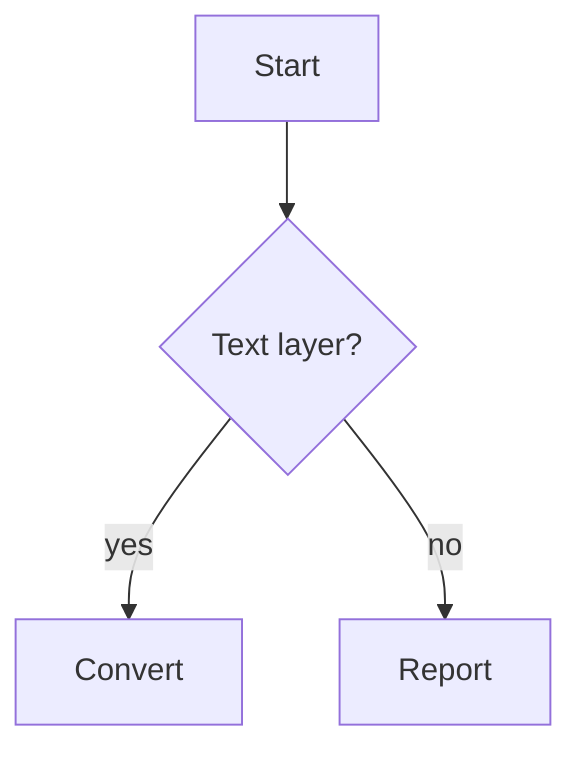

# Setup

We follow the attention formulation of [@vaswani2017attention] and the
literate-programming tradition [@knuth1984literate].[^fn1]

[^fn1]: Footnotes must survive the trip.

# Math

Inline math $\epsilon(t) = \alpha e^{-\lambda t}$ appears mid-sentence, and
display math follows:

$$
S = \frac{h + m + r}{3}
$$

A matrix for the matrix-minded:

$$
\begin{pmatrix} 1 & 2 \\ 3 & 4 \end{pmatrix}
$$

# Tables

| Method | Score |
|---|---:|
| baseline | 0.71 |
| ours | 0.94 |

# Diagrams (graceful handling)

The fence above is not convertible; it must arrive as a labeled code block,
not as a crash.
